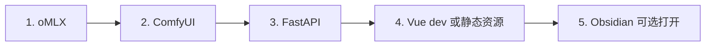

# House-DIY 本地环境配置指南

> 目标平台：Mac M4 Pro 48GB · 100% 本地离线运行（模型首次下载需联网）

---

## 1. 系统前提

| 项 | 要求 |
|----|------|
| 系统 | macOS 15.0+ |
| 芯片 | Apple Silicon |
| 内存 | ≥ 32GB（推荐 48GB） |
| 磁盘 | ≥ 100GB 可用 |
| 工具 | Xcode Command Line Tools |

```bash
xcode-select --install
```

---

## 2. 基础工具链

### 2.1 Homebrew

```bash
/bin/bash -c "$(curl -fsSL https://raw.githubusercontent.com/Homebrew/install/HEAD/install.sh)"
brew update
```

### 2.2 通用依赖

```bash
brew install git python@3.11 node@20 redis
```

| 组件 | 版本建议 | 用途 |
|------|----------|------|
| Python | 3.11+ | FastAPI、Scene Builder、RAG |
| Node.js | 20 LTS | Vue 3 前端 |
| Redis | 7.x（可选） | 任务队列；MVP 可用内存队列替代 |
| Git | 最新 | 版本管理 |

### 2.3 Python 虚拟环境（后端）

```bash
mkdir -p ~/House-DIY-env
python3.11 -m venv ~/House-DIY-env
source ~/House-DIY-env/bin/activate
pip install --upgrade pip
```

后端核心依赖（实现阶段写入 `server/requirements.txt`）：

```
fastapi>=0.110
uvicorn[standard]>=0.27
sqlalchemy>=2.0
aiosqlite>=0.19
openai>=1.40
httpx>=0.27
python-multipart>=0.0.9
pydantic>=2.6
shapely>=2.0
opencv-python-headless>=4.9
numpy>=1.26
trimesh>=4.0
pyyaml>=6.0
watchdog>=4.0
chromadb>=0.5
```

---

## 3. oMLX（本地大模型 / VLM / Embedding）

### 3.1 安装

**方式 A：Homebrew（推荐 CLI + 后台服务）**

```bash
brew tap jundot/omlx https://github.com/jundot/omlx
brew install omlx
```

**方式 B：macOS App**

从 [oMLX Releases](https://github.com/jundot/omlx/releases) 下载 `.dmg`，安装到应用程序。适合菜单栏管理；CLI 需另装 Homebrew 版。

### 3.2 模型目录

```bash
mkdir -p ~/models
```

推荐目录结构（MLX 格式，可从 oMLX Admin 或 HuggingFace `mlx-community` 下载）：

```
~/models/
├── Qwen3-Coder-Next-8bit/          # 文本：DesignSpec、摘要、编排
├── Qwen3.5-9B-Instruct-4bit/       # 备选轻量文本
├── Qwen3-VL-4B-Instruct-3bit/      # 视觉：户型图理解（按 oMLX 支持列表选型）
└── bge-m3/                         # Embedding：Obsidian RAG
```

### 3.3 启动与内存限制（48GB 机器）

为 ComfyUI 预留显存/统一内存，建议限制 oMLX 模型内存：

```bash
omlx serve \
  --model-dir ~/models \
  --port 8000 \
  --max-model-memory 28GB \
  --max-process-memory 80% \
  --paged-ssd-cache-dir ~/.omlx/cache \
  --hot-cache-max-size 20% \
  --max-concurrent-requests 4
```

或使用 Homebrew 服务：

```bash
brew services start omlx
```

### 3.4 验证

```bash
curl http://127.0.0.1:8000/v1/models
curl http://127.0.0.1:8000/v1/chat/completions \
  -H "Content-Type: application/json" \
  -d '{"model":"<你的模型目录名>","messages":[{"role":"user","content":"你好"}]}'
```

Admin：`http://127.0.0.1:8000/admin`

### 3.5 Admin 建议配置

- **Pin** 文本 LLM（编排常用）
- VLM、Embedding **按需加载** 或设较短 TTL，避免与 ComfyUI 同时满载
- 在 Admin 中为模型设置 **alias**（如 `house-llm`、`house-vlm`、`house-embed`），便于后端配置

---

## 4. ComfyUI（2D 效果图）

### 4.1 安装（macOS）

```bash
git clone https://github.com/comfyanonymous/ComfyUI.git ~/ComfyUI
cd ~/ComfyUI
python3 -m venv venv
source venv/bin/activate
pip install -r requirements.txt
```

或使用 [ComfyUI Desktop for Mac](https://www.comfy.org/download)。

### 4.2 模型（示例）

将模型放入 ComfyUI 约定目录：

```
ComfyUI/models/
├── checkpoints/     # FLUX / SDXL 量化版
├── controlnet/      # depth、canny、lineart
├── loras/           # 室内风格 LoRA
└── vae/
```

48GB 建议优先 **FLUX.1-dev 4bit/8bit** 或 **SDXL**，按房间 1024² 出图。

### 4.3 启动

```bash
cd ~/ComfyUI
source venv/bin/activate
python main.py --listen 127.0.0.1 --port 8188
```

验证：浏览器打开 `http://127.0.0.1:8188`

### 4.4 工作流

将项目内 `workflows/` 模板（实现阶段提供）导入 ComfyUI，记下 workflow JSON 与 API 节点 ID，供 `comfy_client.py` 调用。

---

## 5. Obsidian（设计知识库）

### 5.1 安装

从 [obsidian.md](https://obsidian.md) 安装客户端（可选；后端可直接读写 Vault 文件夹）。

### 5.2 Vault 初始化

```bash
mkdir -p ~/House-DIY-Vault/{Cases,References,Templates,Assets,Specs,.house-diy}
```

| 目录 | 用途 |
|------|------|
| `Cases/` | 每次设计自动生成的案例笔记 |
| `References/` | 外部导入的风格参考 |
| `Templates/` | DesignSpec / Comfy 预设模板 |
| `Assets/` | 图片、缩略图 |
| `Specs/` | DesignSpec JSON 附件 |
| `.house-diy/` | 向量索引元数据（应用管理，可不进 Obsidian 图谱） |

复制项目模板（实现阶段提供 `vault-templates/`）：

```bash
cp -r House-DIY/vault-templates/* ~/House-DIY-Vault/Templates/
```

### 5.3 可选：Local REST API 插件

若需在 Obsidian 运行时由插件暴露 HTTP API，可安装社区插件 **Local REST API**；**MVP 推荐仅用文件系统读写**，不依赖 Obsidian 进程。

### 5.4 环境变量（后端 `.env`）

```bash
HOUSE_DIY_VAULT_PATH=~/House-DIY-Vault
HOUSE_DIY_OMLX_BASE_URL=http://127.0.0.1:8000/v1
HOUSE_DIY_OMLX_LLM_MODEL=house-llm
HOUSE_DIY_OMLX_VLM_MODEL=house-vlm
HOUSE_DIY_OMLX_EMBED_MODEL=house-embed
HOUSE_DIY_COMFY_URL=http://127.0.0.1:8188
```

---

## 6. 向量库（Obsidian RAG）

MVP 使用 **Chroma 持久化**（纯本地）：

```bash
source ~/House-DIY-env/bin/activate
pip install chromadb
```

数据目录：`~/House-DIY-Vault/.house-diy/chroma/`

索引由 FastAPI 后台任务维护；Obsidian 中人工修改笔记后，通过 `watchdog` 监听或手动触发 `POST /api/v1/knowledge/reindex`。

---

## 7. 前端（Vue 3）

```bash
cd House-DIY/web
npm install
npm run dev
```

默认 `http://127.0.0.1:5173`，通过 Vite proxy 转发 API 到 `8080`。

---

## 8. 后端 API

```bash
cd House-DIY/server
source ~/House-DIY-env/bin/activate
cp .env.example .env
# 编辑 .env
uvicorn app.main:app --host 127.0.0.1 --port 8080 --reload
```

健康检查：`http://127.0.0.1:8080/api/v1/health`

---

## 9. 一键启动顺序（运行日）



| 顺序 | 命令 / 动作 |
|------|-------------|
| 1 | 启动 oMLX（`brew services start omlx` 或 `omlx serve ...`） |
| 2 | 启动 ComfyUI（8188） |
| 3 | 启动 FastAPI（8080） |
| 4 | 启动 Vue（5173）或生产静态文件 |
| 5 | 可选打开 Obsidian 浏览 `~/House-DIY-Vault` |

**内存调度原则**：同一时刻仅一个「重载」任务——VLM 解析、ComfyUI 批量生图、大上下文 LLM 三者串行或队列化。

---

## 10. 验收清单

- [ ] `curl http://127.0.0.1:8000/v1/models` 返回已加载模型
- [ ] ComfyUI 8188 可访问，测试 workflow 出图一张
- [ ] `curl http://127.0.0.1:8080/api/v1/health` 返回 ok
- [ ] Vue 可上传图片并调用 API
- [ ] Vault 目录可写入测试 `Cases/test.md`
- [ ] Embedding 接口可对测试文本返回向量
- [ ] 断网状态下（模型已下载）可完成一次完整离线演示

---

## 11. 常见问题

| 现象 | 处理 |
|------|------|
| oMLX OOM | 降低 `--max-model-memory`；卸载未用模型；启用 SSD KV cache |
| ComfyUI 与 oMLX 同时卡死 | 编排队列改为串行；生图时 Pin 仅保留小 LLM |
| VLM 读户型不准 | 使用 2D 校对器；勿跳过 `floorplan confirmed` 步骤 |
| Obsidian 与程序同时改同一文件 | 以 FastAPI 写入为准；Obsidian 改后触发 reindex |
