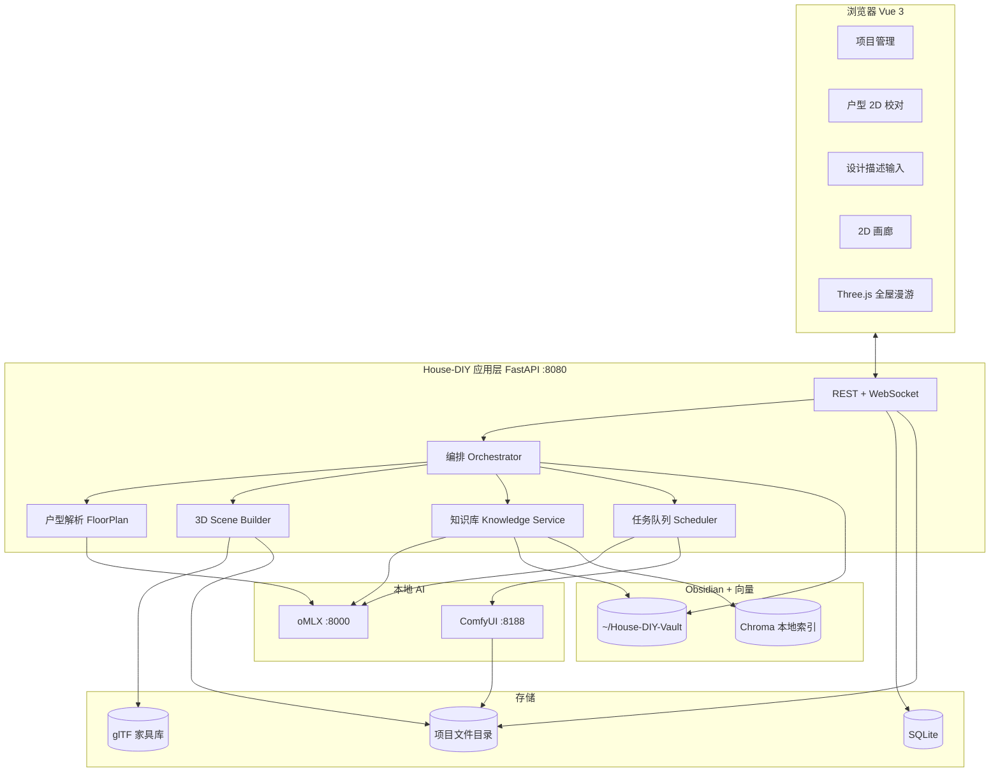
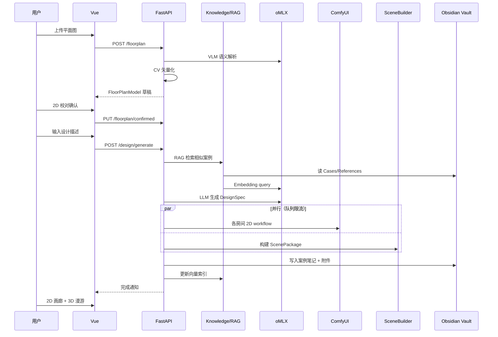
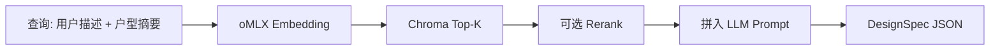

# House-DIY 产品架构与技术方案

> 版本：1.0 · 日期：2026-05-19 · 推理：oMLX · 知识库：Obsidian + RAG

---

## 1. 产品定位

### 1.1 是什么

面向个人/DIY 用户的 **本地离线** 室内设计 Web 应用：

1. 上传 **开发商标准平面图**（PNG/PDF）
2. **2D 校对** 墙线、房间、门窗
3. 用自然语言描述风格与需求
4. 生成 **全屋真 3D 漫游**（Three.js）+ **各主要房间高质量 2D 效果图**（ComfyUI）
5. 每次设计与外部参考自动/半自动沉淀到 **Obsidian Vault**，供后续 RAG 借鉴

### 1.2 差异化（相对 Coohom / Planner 5D）

| 维度 | 商业 SaaS | House-DIY |
|------|-----------|-----------|
| 推理与数据 | 云端 | 本机 oMLX + ComfyUI |
| 隐私 | 账号与上传在云端 | 项目与 Vault 全在本地 |
| 3D 资产 | 百万级内置库 | 自建 glTF 库（MVP 几十～几百 SKU） |
| 设计记忆 | 平台内封闭 | **Obsidian 可读可改 + RAG** |
| 定制 | 固定功能 | 可改 ComfyUI workflow、DesignSpec 模板 |

### 1.3 刻意不做（MVP）

- 在线协作、账号体系、移动端 AR
- 建材报价、品牌供应链、施工图导出
- 模型在线 fine-tune；仅 RAG 积累案例

---

## 2. 总体架构



---

## 3. 端到端数据流



---

## 4. 技术栈

### 4.1 前端

| 技术 | 用途 |
|------|------|
| Vue 3 + TypeScript | SPA |
| Vite | 构建与 dev server |
| Pinia | 状态 |
| Vue Router | 路由 |
| Three.js | 3D 漫游、Portal、碰撞 |
| Fabric.js / Konva | 户型 2D 校对 |
| Element Plus | UI 组件 |
| axios + WebSocket | API 与进度 |

### 4.2 后端

| 技术 | 用途 |
|------|------|
| Python 3.11 + FastAPI | API、编排、任务 |
| SQLAlchemy + SQLite | 元数据 |
| openai SDK | 调用 oMLX（OpenAI 兼容） |
| httpx | ComfyUI API |
| OpenCV + Shapely | 户型几何 |
| trimesh | 3D 挤出与导出辅助 |
| watchdog | 监听 Vault 变更 |
| ChromaDB | 向量持久化 |

### 4.3 AI 与渲染

| 技术 | 用途 |
|------|------|
| **oMLX** | 文本 LLM、VLM、Embedding、（可选）Rerank |
| **ComfyUI** | FLUX/SDXL + ControlNet 室内效果图 |
| 程序化 + glTF | 真 3D 场景（非文生 3D） |

### 4.4 知识库

| 技术 | 用途 |
|------|------|
| **Obsidian Vault**（Markdown + 附件） | 人可读案例、模板、参考 |
| Chroma + oMLX Embedding | 语义检索 |
| YAML Frontmatter | 结构化元数据 |

---

## 5. Obsidian 集成方案

### 5.1 集成模式

**主模式：文件系统直连（推荐）**

- 后端配置 `HOUSE_DIY_VAULT_PATH`
- 使用统一 Frontmatter 模板读写 `Cases/`、`References/`
- Obsidian 仅作为可选编辑器；**不依赖** Obsidian 进程

**辅模式（可选）**：Obsidian Local REST API 插件，用于双向实时同步（Phase 3）。

### 5.2 Vault 目录规范

```
~/House-DIY-Vault/
├── Cases/              # 内部项目完成后自动生成
├── References/         # 外部导入
├── Templates/          # 风格/房间模板
├── Assets/             # 图片
├── Specs/              # designspec.json
└── .house-diy/
    ├── chroma/         # 向量库
    └── index_state.json
```

### 5.3 笔记类型（Frontmatter）

```yaml
---
type: design_case          # design_case | style_ref | comfy_preset | template
project_id: ""
rooms: []
style: ""
tags: []
rating: 0
source: internal           # internal | import_pdf | import_image | import_url
created: 2026-05-19T10:00:00
---
```

### 5.4 RAG 流程



**原则**

- RAG 只提供参考，不覆盖 `FloorPlanModel` 几何约束
- 用户可在 Obsidian 修改笔记 → 触发 `reindex`
- 不自动 fine-tune 模型权重

### 5.5 案例自动沉淀（设计完成后）

1. LLM 生成案例摘要（风格、家具策略、Comfy 预设名）
2. 写入 `Cases/{date}-{project_name}.md`
3. 复制效果图至 `Assets/`，DesignSpec 至 `Specs/`
4. 对笔记正文 + 关键字段做 Embedding 写入 Chroma
5. Obsidian 中用户可补充 `tags`、`rating`；高 `rating` 案例在 RAG 时加权

### 5.6 外部导入

| 来源 | API | 处理 |
|------|-----|------|
| PDF | `POST /knowledge/import` | 转图 → VLM 摘要 → `References/` |
| 图片 | 同上 | VLM → 风格标签 |
| URL | Phase 3 | 剪藏为 Markdown |
| ComfyUI JSON | 手动/导入 | `Templates/comfy_*.md` |

---

## 6. 核心数据模型

### 6.1 DesignSpec（编排中枢）

```json
{
  "version": 1,
  "globalStyle": "现代简约、暖白、原木",
  "ragContextIds": ["case-uuid-1"],
  "rooms": [
    {
      "id": "living_room",
      "name": "客厅",
      "style": "现代简约",
      "palette": ["#F5F0E8", "#8B7355"],
      "furniture": [
        {
          "sku": "sofa_3seat_modern_01",
          "wall": "south",
          "offset": [1.2, 0.0],
          "rotation": 0
        }
      ],
      "render2d": {
        "prompt": "interior design, modern living room, ...",
        "negative": "blurry, distorted",
        "workflow": "living_modern_v1",
        "controlnet": "layout_depth"
      },
      "render3d": {
        "floorMaterial": "oak_light",
        "wallMaterial": "paint_warm_white",
        "ceilingHeight": 2.8,
        "lighting": "day_soft"
      }
    }
  ]
}
```

### 6.2 FloorPlanModel

- `scale`：像素/米比例
- `walls[]`：线段或折线
- `rooms[]`：多边形 + name + area
- `openings[]`：门/窗（连接房间 id）
- `status`：`draft` | `confirmed`

### 6.3 ScenePackage

- `scene.gltf` + `scene.json`（Portal、房间 id、NavMesh 路径）
- `collision.bin`（可选）

---

## 7. API 概要

| 方法 | 路径 | 说明 |
|------|------|------|
| GET | `/api/v1/health` | 健康检查 + 依赖服务状态 |
| POST | `/api/v1/projects` | 创建项目 |
| POST | `/api/v1/projects/{id}/floorplan` | 上传平面图，触发解析 |
| GET/PUT | `/api/v1/projects/{id}/floorplan` | 获取/保存校对结果 |
| POST | `/api/v1/projects/{id}/design/generate` | 提交描述，启动流水线 |
| GET | `/api/v1/projects/{id}/tasks/{taskId}` | 任务状态 |
| WS | `/api/v1/projects/{id}/ws` | 进度推送 |
| GET | `/api/v1/projects/{id}/renders` | 2D 效果图列表 |
| GET | `/api/v1/projects/{id}/scene` | 3D 场景包 URL |
| POST | `/api/v1/knowledge/import` | 导入外部参考 |
| POST | `/api/v1/knowledge/reindex` | 重建向量索引 |
| GET | `/api/v1/knowledge/search` | 调试检索 |

---

## 8. 3D 漫游设计要点

- 墙：`FloorPlanModel` 闭合多边形 → 挤出高度（默认 2.8m）
- 门洞：布尔或预制洞 + **Portal**（`targetRoomId` + 触发体积）
- 家具：glTF SKU + DesignSpec 规则摆放（留通道、不挡门）
- 导航：每房间简化 NavMesh；第一人称 WASD + 指针锁定
- 加载：按房间 LOD；重复家具 `InstancedMesh`

---

## 9. 内存与任务调度（48GB）

| 阶段 | 占用主力 | 说明 |
|------|----------|------|
| 户型 VLM | oMLX VLM ~12–18GB | 完成后可 TTL 卸载 |
| DesignSpec + RAG | oMLX LLM + Embed ~8–12GB | 可与 Embed 串行 |
| 2D 批量 | ComfyUI ~14–18GB | 与 VLM 互斥 |
| 3D 构建 | CPU 为主 | 与 Comfy 可交错 |

**Scheduler 规则**

1. 全局队列：同一时刻最多 1 个 GPU 重任务
2. ComfyUI 按房间串行
3. 失败重试最多 2 次，保留中间产物

---

## 10. 项目目录结构（目标）

```
House-DIY/
├── README.md
├── docs/                          # 本文档集
├── vault-templates/                 # Obsidian 笔记模板
├── workflows/                       # ComfyUI API workflow JSON
├── assets/
│   ├── furniture/                   # glTF
│   └── materials/                   # PBR 贴图
├── web/                             # Vue 3
│   ├── src/
│   │   ├── views/
│   │   ├── components/
│   │   │   ├── FloorPlanEditor/
│   │   │   └── SceneViewer3D/
│   │   └── api/
│   └── package.json
├── server/                          # FastAPI
│   ├── app/
│   │   ├── main.py
│   │   ├── api/
│   │   ├── services/
│   │   │   ├── orchestrator.py
│   │   │   ├── floorplan.py
│   │   │   ├── omlx_client.py
│   │   │   ├── comfy_client.py
│   │   │   ├── scene_builder.py
│   │   │   └── knowledge.py
│   │   └── models/
│   ├── requirements.txt
│   └── .env.example
└── scripts/
    ├── start-all.sh
    └── check-deps.sh
```

---

## 11. 与市面方案对照

| 能力 | Coohom 等 | House-DIY |
|------|-----------|-----------|
| 户型编辑 | 极强 | 中（2D 校对 + 标准图） |
| 3D 资产 | 百万 | 自建扩展 |
| 2D 效果图 | 商业渲染器 | ComfyUI |
| 知识积累 | 平台内 | **Obsidian + RAG** |
| 离线隐私 | 弱 | **强** |

---

## 12. 风险矩阵

| 风险 | 等级 | 缓解 |
|------|------|------|
| 户型自动解析偏差 | 高 | 强制 2D 校对 |
| 2D/3D 视觉不一致 | 中 | 同源 DesignSpec，产品文案说明 |
| GPU 争抢 | 中 | 编排队列 |
| 资产版权 | 中 | 授权清单 |
| RAG 幻觉 | 中 | 几何约束优先；案例注明仅供参考 |
