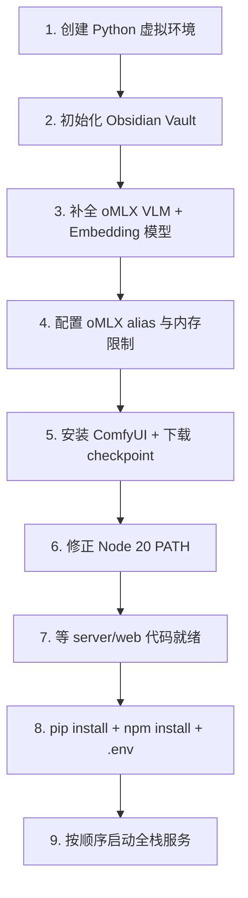

# House-DIY 本地环境检查与安装步骤

> 基于 [01-本地环境配置指南](./01-本地环境配置指南.md) 对本机环境的逐项检查结果，以及待补齐项的详细操作步骤。  
> 检查日期：2026/05/23（三次复查）· 目标平台：Mac M4 Pro 48GB  
> 安装操作记录：[05-安装操作记录](./05-安装操作记录.md)

---

## 1. 检查总览

| 类别 | 状态 | 说明 |
|------|------|------|
| 系统硬件 | ✅ 已满足 | macOS 26.3.1 · Apple Silicon · 48GB · 约 623GB 可用 |
| Xcode CLI | ✅ 已安装 | `/Library/Developer/CommandLineTools` |
| Homebrew | ✅ 已安装 | v5.1.12 |
| Git | ✅ 已安装 | Homebrew Git 2.54.0 · `/opt/homebrew/bin/git` |
| Python 3.11+ | ✅ 已满足 | `python@3.12` 3.12.13 · 虚拟环境已创建 |
| Node.js 20 LTS | ✅ 已安装 | v20.20.2 · `~/.zshrc` 已配置 `node@20` PATH |
| Redis | ✅ 已安装 | Docker 容器 `house-diy-redis` · `PONG` |
| Python 虚拟环境 | ✅ 已创建 | `~/House-DIY-env` · Python 3.12.13 · pip 26.1.1 |
| oMLX | ✅ 已就绪 | App 运行中（8000）· 模型已齐 · **alias 已配置** · 内存 28GB / 80% |
| oMLX 模型 | ✅ 已齐 | 文本 / VLM / Embedding 均已下载至 `~/models` |
| ComfyUI | ✅ 已就绪 | 运行中（8188）· FLUX 8 模型 · workflow 已验证出图 |
| Obsidian Vault | ✅ 已初始化 | `~/House-DIY-Vault` · 子目录 + Chroma 已创建 |
| Obsidian 客户端 | ✅ 已安装 | `/Applications/Obsidian.app`（可选） |
| 项目代码 | ❌ 未就绪 | 有 `docs/`、`workflows/`、`script/`；尚无 `web/`、`server/`、`vault-templates/` |
| 后端依赖 / ChromaDB | ❌ 未安装 | venv 存在，未装 FastAPI / chromadb 等包 |
| 前端依赖 | ❌ 未安装 | `web/` 目录不存在 |
| 运行中服务 | ⚠️ 部分 | oMLX ✅ · Redis ✅ · ComfyUI ✅ · FastAPI / Vue ❌（未启动） |

**图例：** ✅ 已就绪 · ⚠️ 部分就绪或待配置 · ❌ 未安装/未配置

**较上次检查（2026/05/23 二次复查）主要变化：** ComfyUI 已启动并验证 FLUX 出图；项目新增 `workflows/`；Embedding API 实测通过；磁盘可用约 623GB。仍缺 `server/`、`web/`、全栈联调。

---

## 2. 已就绪项（无需重复安装）

以下组件已满足或基本满足文档要求，可直接使用：

### 2.1 系统与基础工具

- macOS 15.0+、Apple Silicon、≥ 32GB 内存、≥ 100GB 磁盘
- Xcode Command Line Tools
- Homebrew 5.1.12
- Homebrew Git 2.54.0（`~/.zshrc` 已配置 `/opt/homebrew/bin` 优先）
- Python 3.12 虚拟环境 `~/House-DIY-env`
- Node.js 20.20.2（`~/.zshrc` 已配置 `node@20` PATH）
- Redis 7.x（Docker 容器 `house-diy-redis`，端口 6379）

### 2.2 oMLX App

- 安装路径：`/Applications/oMLX.app`
- 服务地址：`http://127.0.0.1:8000`（运行中，API 需 Key 认证）
- 模型目录：`~/models`
- 配置目录：`~/.omlx/`
- 已启用 API Key 认证（调用 API 时需携带 `Authorization: Bearer <key>`）

### 2.3 已有 oMLX 模型

| 模型 ID | 用途 | alias | 状态 |
|---------|------|-------|------|
| `Qwen3.5-9B` | 文本 LLM | `house-llm` | ✅ default · Pin |
| `Qwen3-Coder-30B` | 文本 LLM（备选） | — | ✅ 已有 |
| `Qwen3-VL-4B-Instruct-4bit` | VLM 户型图 | `house-vlm` | ✅ 已有 |
| `bge-m3-mlx-fp16` | Embedding / RAG | `house-embed` | ✅ 已有 |
| `gemma-4-26b-a4b-it-4bit` | 额外文本 | — | ✅ 非必需 |
| `qwen3-0.6b-mlx` | 轻量测试 | — | ✅ 非必需 |

> **已配置（2026/05/23）：** Admin 中 alias `house-llm` / `house-vlm` / `house-embed` 已设置；内存限制 28GB / 80%；SSD cache `/Users/niuniu/.omlx/cache`。

验证命令（需替换 `<API_KEY>`）：

```bash
curl -H "Authorization: Bearer <API_KEY>" http://127.0.0.1:8000/v1/models
```

Admin 面板：http://127.0.0.1:8000/admin

### 2.4 ComfyUI

- 安装路径：`~/ComfyUI`（源码 + venv · Python 3.12.13 · torch 2.12.0）
- 服务地址：`http://127.0.0.1:8188`（**运行中**，HTTP 200）
- 已下载模型（约 25 GB，8 个 safetensors）：

| 文件 | 目录 |
|------|------|
| `flux1-dev-fp8.safetensors` | `models/diffusion_models/` |
| `clip_l.safetensors`、`t5xxl_fp8_e4m3fn.safetensors` | `models/text_encoders/` |
| `ae.safetensors` | `models/vae/` |
| `flux-depth/canny/hed-controlnet-v3.safetensors` | `models/controlnet/` |
| `interior-lora.safetensors` | `models/loras/` |

详见 [05-安装操作记录 §6](./05-安装操作记录.md)。

**测试 workflow（项目内）：**

| 文件 | 用途 |
|------|------|
| `workflows/flux_interior_t2i.json` | GUI 导入（FLUX + 室内 LoRA） |
| `workflows/flux_interior_t2i_api.json` | API 提交 |

已验证出图：`~/ComfyUI/output/house-diy/interior_00001_.png` 等。运维见 [05 §6.7](./05-安装操作记录.md#67-comfyui-日常运维与-apiworkflow)。

---

## 3. 待补齐项与详细安装步骤

> **复查说明（2026/05/23 三次复查）：** 带 ✅ 的小节已完成，可跳过安装步骤；带 ❌ 的仍待执行（主要为 `server/` / `web/` 代码阻塞）。

建议按本章顺序操作，后续步骤依赖前面的结果。

### 3.1 Python 虚拟环境（P0 · 必做）✅ 已完成

> 2026/05/20 已按方案 A 创建。详见 [05-安装操作记录 §2](./05-安装操作记录.md)。

#### 方案 A：使用已有 Python 3.12（推荐）

```bash
# 确保 brew Python 在 PATH 前面
echo 'export PATH="/opt/homebrew/opt/python@3.12/bin:$PATH"' >> ~/.zshrc
source ~/.zshrc

# 创建虚拟环境
mkdir -p ~/House-DIY-env
/opt/homebrew/bin/python3.12 -m venv ~/House-DIY-env
source ~/House-DIY-env/bin/activate
pip install --upgrade pip
```

#### 方案 B：严格按文档安装 Python 3.11

```bash
brew install python@3.11
echo 'export PATH="/opt/homebrew/opt/python@3.11/bin:$PATH"' >> ~/.zshrc
source ~/.zshrc

mkdir -p ~/House-DIY-env
python3.11 -m venv ~/House-DIY-env
source ~/House-DIY-env/bin/activate
pip install --upgrade pip
```

#### 验证

```bash
source ~/House-DIY-env/bin/activate
python --version          # 应显示 3.12.x 或 3.11.x
which python              # 应指向 ~/House-DIY-env/bin/python
pip --version
```

#### 日常使用

每次开发后端前激活虚拟环境：

```bash
source ~/House-DIY-env/bin/activate
```

---

### 3.2 Node.js 20 LTS（P1 · 前端开发前必做）✅ 已完成

> 2026/05/20 已安装 `node@20` 20.20.2 并配置 PATH。详见 [05-安装操作记录 §3](./05-安装操作记录.md)。

~~当前 PATH 优先使用 Cursor 内置 Node v22，与文档要求的 Node 20 LTS 不一致。建议单独安装 Node 20 并调整 PATH 优先级。~~

```bash
brew install node@20

# 让 Node 20 优先于 Cursor 内置 node
echo 'export PATH="/opt/homebrew/opt/node@20/bin:$PATH"' >> ~/.zshrc
source ~/.zshrc

node --version    # 应显示 v20.x
npm --version
```

> 若已安装其他 Node 版本（如 `node@24`），不影响并存；关键是 PATH 中 `node@20` 排在最前。

---

### 3.3 Obsidian Vault 初始化（P0 · 必做）✅ 已完成

> 2026/05/23 已创建目录结构。详见 [05-安装操作记录 §7](./05-安装操作记录.md)。  
> `vault-templates/` 复制待项目实现阶段。

MVP 不依赖 Obsidian 客户端，后端直接读写 Vault 文件夹即可。

```bash
mkdir -p ~/House-DIY-Vault/{Cases,References,Templates,Assets,Specs,.house-diy}
mkdir -p ~/House-DIY-Vault/.house-diy/chroma
```

| 目录 | 用途 |
|------|------|
| `Cases/` | 每次设计自动生成的案例笔记 |
| `References/` | 外部导入的风格参考 |
| `Templates/` | DesignSpec / Comfy 预设模板 |
| `Assets/` | 图片、缩略图 |
| `Specs/` | DesignSpec JSON 附件 |
| `.house-diy/` | 向量索引元数据（Chroma 持久化目录） |

等项目提供 `vault-templates/` 后，复制模板：

```bash
cp -r /Users/niuniu/project/House-DIY/vault-templates/* ~/House-DIY-Vault/Templates/
```

#### 验证

```bash
echo "# test" > ~/House-DIY-Vault/Cases/test.md
cat ~/House-DIY-Vault/Cases/test.md
ls ~/House-DIY-Vault/.house-diy/chroma
```

#### Obsidian 客户端（可选）✅ 已安装

本机已安装 `/Applications/Obsidian.app`。Vault 初始化后，在 Obsidian 中选择「打开文件夹作为仓库」→ `~/House-DIY-Vault`。

~~1. 访问 https://obsidian.md 下载 macOS 客户端~~

---

### 3.4 oMLX 模型补全与配置（P0 · 必做）✅ 已完成

#### 3.4.1 模型状态（2026/05/23 复查）

| 模型 | 用途 | 当前状态 |
|------|------|----------|
| `Qwen3-VL-4B-Instruct-4bit` | 户型图视觉理解 (VLM) | ✅ 已有 |
| `bge-m3-mlx-fp16` | Embedding / Obsidian RAG | ✅ 已有 |
| `Qwen3-Coder-30B` / `Qwen3.5-9B` | 文本 LLM | ✅ 已有 |
| `Qwen3-Coder-Next-8bit` | 文档推荐文本模型 | ⏭️ 可跳过（30B 替代） |
| alias `house-llm/vlm/embed` | 后端 `.env` 引用 | ✅ 已配置 |
| 内存限制 28GB / 80% | 与 ComfyUI 共存 | ✅ 已配置 |

#### 3.4.2 下载模型（首次需联网）✅ 已完成

**方式 A：oMLX Admin（推荐）**

1. 打开 http://127.0.0.1:8000/admin
2. 在模型管理页搜索并下载 VLM、Embedding 模型
3. 确认模型出现在 `~/models/` 目录

**方式 B：HuggingFace 手动下载**

从 [mlx-community](https://huggingface.co/mlx-community) 下载 MLX 格式模型，解压到 `~/models/`：

```
~/models/
├── Qwen3-Coder-30B/              # ✅ 文本 LLM
├── Qwen3.5-9B/                   # ✅ 轻量文本
├── Qwen3-VL-4B-Instruct-4bit/    # ✅ VLM
├── bge-m3-mlx-fp16/              # ✅ Embedding
└── …（其他非必需模型）
```

#### 3.4.3 Admin 建议配置 ✅ 已完成（2026/05/23）

已在 oMLX Admin 完成以下设置（详见 [05-安装操作记录 §8](./05-安装操作记录.md#8-omlx-admin-配置alias--内存)）：

1. **Pin** 常用文本 LLM（如 `Qwen3.5-9B` 或 `Qwen3-Coder-30B`），保证编排任务快速响应
2. VLM、Embedding 设为**按需加载**或较短 TTL，避免与 ComfyUI 同时满载
3. 为模型设置 **alias**，便于后端 `.env` 引用：

| 模型 | 建议 alias | 用途 |
|------|------------|------|
| `Qwen3.5-9B` 或 `Qwen3-Coder-30B` | `house-llm` | 文本编排 |
| `Qwen3-VL-4B-Instruct-4bit` | `house-vlm` | 户型图理解 |
| `bge-m3-mlx-fp16` | `house-embed` | 向量检索 |

#### 3.4.4 48GB 内存限制配置 ✅ 已完成

当前 oMLX 内存策略（`~/.omlx/settings.json`）：

```json
"model": {
  "max_model_memory": "28GB"
},
"memory": {
  "max_process_memory": "80%"
},
"cache": {
  "ssd_cache_dir": "/Users/niuniu/.omlx/cache",
  "hot_cache_max_size": "20%"
}
```

修改后重启 oMLX App（菜单栏退出并重新打开）。

也可通过 CLI 启动（若安装了 Homebrew 版）：

```bash
omlx serve \
  --model-dir ~/models \
  --port 8000 \
  --max-model-memory 28GB \
  --max-process-memory 80% \
  --paged-ssd-cache-dir ~/.omlx/cache \
  --hot-cache-max-size 20% \
  --max-concurrent-requests 4
```

#### 3.4.5 验证

```bash
# 列出模型（需 API Key）
curl -H "Authorization: Bearer <API_KEY>" http://127.0.0.1:8000/v1/models

# 测试对话
curl http://127.0.0.1:8000/v1/chat/completions \
  -H "Content-Type: application/json" \
  -H "Authorization: Bearer <API_KEY>" \
  -d '{"model":"Qwen3.5-9B","messages":[{"role":"user","content":"你好"}]}'
```

#### 3.4.6 可选：安装 Homebrew CLI 版 oMLX

若希望通过 `brew services` 管理 oMLX 后台服务：

```bash
brew tap jundot/omlx https://github.com/jundot/omlx
brew install omlx
brew services start omlx
```

> **注意：** 若已使用 App 版 oMLX，CLI 版与 App 版二选一即可，避免两个实例同时占用 8000 端口。

---

### 3.5 ComfyUI 安装（P0 · 必做）✅ 已完成 · 已验证出图

> 2026/05/20 源码安装；2026/05/21 FLUX fp8 及附属模型已下载；2026/05/23 启动服务并 API/GUI 出图验证。详见 [05-安装操作记录 §5、§6、§6.7](./05-安装操作记录.md)。  
> **当前状态：** 8188 运行中 · workflow 模板已就绪 · 已产出测试图。

ComfyUI 负责 2D 效果图生成，监听 `8188` 端口。

#### 3.5.1 源码安装（推荐）

```bash
git clone https://github.com/comfyanonymous/ComfyUI.git ~/ComfyUI
cd ~/ComfyUI

python3 -m venv venv
source venv/bin/activate
pip install -r requirements.txt
```

#### 3.5.2 替代方案：Desktop 版

从 [ComfyUI Desktop for Mac](https://www.comfy.org/download) 下载 `.dmg` 安装，适合图形化管理，省去手动 clone。

#### 3.5.3 模型目录

```bash
mkdir -p ~/ComfyUI/models/{checkpoints,controlnet,loras,vae}
```

| 子目录 | 内容 | 48GB 建议 |
|--------|------|-----------|
| `checkpoints/` | 主模型 | FLUX.1-dev 4bit/8bit 或 SDXL |
| `controlnet/` | 控制网 | depth、canny、lineart |
| `loras/` | 风格 LoRA | 室内风格 LoRA |
| `vae/` | VAE | 随 checkpoint 配套 |

模型首次下载需联网，体积较大（单个 checkpoint 可达数 GB ~ 数十 GB）。

#### 3.5.4 启动

```bash
cd ~/ComfyUI
source venv/bin/activate
python main.py --listen 127.0.0.1 --port 8188
```

#### 3.5.5 验证 ✅

```bash
curl -s -o /dev/null -w "HTTP %{http_code}\n" http://127.0.0.1:8188/
# HTTP 200

# API 出图（需 ComfyUI 已启动）
curl -s -X POST http://127.0.0.1:8188/prompt \
  -H "Content-Type: application/json" \
  -d @/Users/niuniu/project/House-DIY/workflows/flux_interior_t2i_api.json
```

浏览器：Load `workflows/flux_interior_t2i.json` → Queue Prompt。勿用 SD 1.5 默认 workflow。

#### 3.5.6 工作流 ✅ 模板已提供

项目 `workflows/` 已含 FLUX 室内 LoRA 测试模板；实现阶段将扩展 `room_render_api.json` 供 `comfy_client.py` 调用。

---

### 3.6 后端 Python 依赖（P0 · 等 `server/` 代码就绪后）❌ 阻塞

```bash
source ~/House-DIY-env/bin/activate
cd /Users/niuniu/project/House-DIY/server

# 若已有 requirements.txt
pip install -r requirements.txt

# 若尚未生成 requirements.txt，按文档预装核心包
pip install \
  "fastapi>=0.110" \
  "uvicorn[standard]>=0.27" \
  "sqlalchemy>=2.0" \
  "aiosqlite>=0.19" \
  "openai>=1.40" \
  "httpx>=0.27" \
  "python-multipart>=0.0.9" \
  "pydantic>=2.6" \
  "shapely>=2.0" \
  "opencv-python-headless>=4.9" \
  "numpy>=1.26" \
  "trimesh>=4.0" \
  "pyyaml>=6.0" \
  "watchdog>=4.0" \
  "chromadb>=0.5"
```

Chroma 向量库数据目录：`~/House-DIY-Vault/.house-diy/chroma/`

#### 配置 `.env`

```bash
cd /Users/niuniu/project/House-DIY/server
cp .env.example .env
```

编辑 `.env`，至少包含：

```bash
HOUSE_DIY_VAULT_PATH=~/House-DIY-Vault
HOUSE_DIY_OMLX_BASE_URL=http://127.0.0.1:8000/v1
HOUSE_DIY_OMLX_LLM_MODEL=house-llm
HOUSE_DIY_OMLX_VLM_MODEL=house-vlm
HOUSE_DIY_OMLX_EMBED_MODEL=house-embed
HOUSE_DIY_OMLX_API_KEY=<你的oMLX_API_Key>
HOUSE_DIY_COMFY_URL=http://127.0.0.1:8188
```

> oMLX 已启用 API Key 认证，后端所有 OpenAI 兼容调用必须配置 `HOUSE_DIY_OMLX_API_KEY`。

#### 启动后端

```bash
source ~/House-DIY-env/bin/activate
cd /Users/niuniu/project/House-DIY/server
uvicorn app.main:app --host 127.0.0.1 --port 8080 --reload
```

#### 验证

```bash
curl http://127.0.0.1:8080/api/v1/health
# 期望返回 ok
```

---

### 3.7 前端 Vue 3（P0 · 等 `web/` 代码就绪后）❌ 阻塞

```bash
cd /Users/niuniu/project/House-DIY/web
npm install
npm run dev
```

默认开发地址：http://127.0.0.1:5173（Vite proxy 转发 API 到 8080）

---

### 3.8 Redis（P2 · 可选）✅ 已完成（Docker）

> 2026/05/20 通过 Docker + Colima 部署。详见 [05-安装操作记录 §4](./05-安装操作记录.md)。

MVP 阶段可用内存队列替代 Redis；本机已安装 Docker 版，可直接对接 Scheduler。

```bash
# 验证
docker ps --filter name=house-diy-redis
docker exec house-diy-redis redis-cli ping    # 期望 PONG

# 启动（Colima 未运行时）
colima start && docker start house-diy-redis
```

连接地址：`redis://127.0.0.1:6379/0`

~~brew 安装方式（未采用）：~~

```bash
# brew install redis
# brew services start redis
# redis-cli ping
```

---

### 3.9 Git（P2 · 可选）✅ 已完成

> 2026/05/20 已安装 Homebrew Git 2.54.0。详见 [05-安装操作记录 §1](./05-安装操作记录.md)。

~~当前 Apple Git 2.50.1 可正常使用。若希望与 Homebrew 生态一致：~~

```bash
# 当前已生效
which git    # /opt/homebrew/bin/git
git --version    # 2.54.0
```

---

## 4. 执行优先级



| 优先级 | 任务 | 状态 | 说明 |
|--------|------|------|------|
| P0 | Python 虚拟环境 | ✅ | 2026/05/20 完成 |
| P0 | Obsidian Vault 目录 | ✅ | 2026/05/23 完成 |
| P0 | oMLX VLM + Embedding | ✅ | 模型已下载 |
| P0 | oMLX alias + 内存调优 | ✅ | 2026/05/23 Admin 配置完成 |
| P0 | ComfyUI + checkpoint | ✅ | FLUX 模型 + workflow 出图已验证 |
| P1 | Node 20 PATH | ✅ | 2026/05/20 完成 |
| P2 | Redis | ✅ | Docker 方式 2026/05/20 完成 |
| P2 | brew install git | ✅ | 2026/05/20 完成 |
| 阻塞 | `server/` 后端 | ❌ | 等项目代码 |
| 阻塞 | `web/` 前端 | ❌ | 等项目代码 |
| 阻塞 | `vault-templates/` | ❌ | 等项目代码 |

---

## 5. 一键启动顺序（运行日）

全部组件安装完成后，按以下顺序启动：

| 顺序 | 命令 / 动作 | 端口 |
|------|-------------|------|
| 1 | 启动 oMLX（App 或 `brew services start omlx`） | 8000 |
| 2 | 启动 ComfyUI | 8188 |
| 3 | 启动 FastAPI | 8080 |
| 4 | 启动 Vue dev 或部署静态资源 | 5173 |
| 5 | 可选打开 Obsidian 浏览 Vault | — |

**内存调度原则：** 同一时刻仅一个「重载」任务——VLM 解析、ComfyUI 批量生图、大上下文 LLM 三者串行或队列化。

---

## 6. 验收清单

> 复查日期：2026/05/23（三次复查）

- [x] oMLX 8000 端口可访问（需 API Key 认证）
- [x] `curl -H "Authorization: Bearer <KEY>" http://127.0.0.1:8000/v1/models` 返回模型含 VLM、Embedding 及 alias
- [x] oMLX Admin 中 alias 已配置：`house-llm`、`house-vlm`、`house-embed`
- [x] oMLX 内存限制已设为 28GB / 80%
- [x] ComfyUI http://127.0.0.1:8188 可访问（8188 运行中，HTTP 200）
- [x] ComfyUI 测试 workflow 出图（`output/house-diy/interior_00001_.png`）
- [ ] `curl http://127.0.0.1:8080/api/v1/health` 返回 ok（`server/` 未实现）
- [ ] Vue http://127.0.0.1:5173 可上传图片并调用 API（`web/` 未实现）
- [x] `~/House-DIY-Vault/Cases/test.md` 可正常写入
- [x] Embedding 接口对测试文本返回向量（`house-embed`，1024 维）
- [ ] 断网状态下（模型已下载）可完成一次完整离线演示（待全栈就绪）
- [x] Redis `docker exec house-diy-redis redis-cli ping` 返回 PONG
- [x] ComfyUI FLUX 模型文件已就位（8 个 safetensors，约 25 GB）

---

## 7. 常见问题

| 现象 | 处理 |
|------|------|
| oMLX API 返回 401 | 检查请求头是否携带 `Authorization: Bearer <API_KEY>` |
| oMLX OOM | 降低 `max_model_memory`；卸载未用模型；启用 SSD KV cache |
| ComfyUI 与 oMLX 同时卡死 | 编排队列改为串行；生图时 Pin 仅保留小 LLM |
| ComfyUI 报缺失 SD1.5 checkpoint | Load `workflows/flux_interior_t2i.json`，勿用默认 SD 1.5 workflow |
| `node --version` 仍显示 v22 | 确认 `~/.zshrc` 中 `node@20` PATH 排在 Cursor 路径之前，重新打开终端 |
| `python3` 仍显示 3.9.6 | 使用 `python3.12` 或激活 `~/House-DIY-env` 后再执行 |
| VLM 读户型不准 | 使用 2D 校对器；勿跳过 `floorplan confirmed` 步骤 |
| Obsidian 与程序同时改同一文件 | 以 FastAPI 写入为准；Obsidian 改后触发 reindex |

---

## 8. 相关文档

- [01-本地环境配置指南](./01-本地环境配置指南.md) — 环境配置原始规范
- [02-产品架构与技术方案](./02-产品架构与技术方案.md) — 系统架构
- [03-实现计划与里程碑](./03-实现计划与里程碑.md) — 开发排期
- [05-安装操作记录](./05-安装操作记录.md) — 已执行命令与结果
