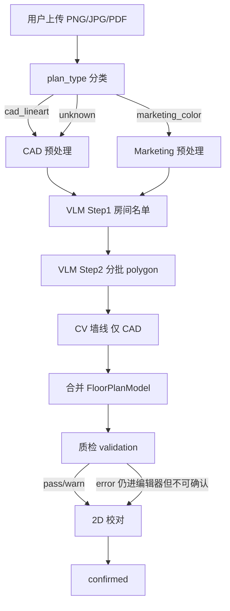

# 户型解析优化 — 需求文档与实现方案

> **文档版本：** v0.1  
> **日期：** 2026-05-20  
> **状态：** ✅ 已确认（2026-05-20）— 在分支 `feat_AnalysisAndOptimization` 实施  
> **关联文档：** [02-产品架构与技术方案](./02-产品架构与技术方案.md)、[03-实现计划与里程碑](./03-实现计划与里程碑.md)、[06-V1-验收清单](./06-V1-验收清单.md)

### 确认结论（产品）

| # | 问题 | 结论 |
|---|------|------|
| Q1 | `validation.level=warning` 是否允许 confirmed？ | **允许**，须二次确认对话框 |
| Q2 | 是否本期实现 PDF 矢量解析？ | **要**，纳入本期 |
| Q3 | 顶点拖拽是否做「吸附墙线」？ | **要**，纳入 P4 |
| Q4 | 专用 seg 模型（M3）是否纳入本期？ | **要**，纳入 Phase 5，非仅预研 |
| Q5 | 黄金样本谁提供？ | **开发侧自行找图** 补充 G-CAD-2/3、G-MKT-2/3 |

**实施范围：** Phase 0～5 全部；分支 `feat_AnalysisAndOptimization`。

---

## 0. 文档说明

本文档在 **P1 户型链路已跑通** 的基础上，针对实际样本暴露的解析质量问题，提出 **双轨优化**：

1. **模型侧**：评估/更换更专业的视觉模型或专用户型能力  
2. **算法侧**：Pipeline 重构、质检、多图源兼容、校对能力补全  

**不在本文档范围：** DesignSpec 生成、ComfyUI 渲染、3D Scene Builder（仅说明户型几何对下游的影响）。

---

## 1. 背景与问题陈述

### 1.1 现状

当前解析链路（`task_parse.py`）：

```
上传 source.png
  → 预处理裁剪（parser_preprocess）
  → oMLX VLM 输出 rooms/openings JSON（parser_vlm）
  → OpenCV Hough 墙线（parser_cv，彩色图跳过）
  → 合并为 FloorPlanModel 草稿
  → 2D 校对页展示
```

已在项目 2（CAD 黑白工程图）上验证：**房间名/面积 OCR 尚可，几何 polygon 严重不准**（重叠、重复框、矩形化、漏房间）；标注页 **CV 墙线与 VLM 房间不同步**。

### 1.2 支持的输入类型（产品承诺 vs 实际能力）

| 类型 | 示例 | 产品文案 | 当前实际 |
|------|------|----------|----------|
| **CAD 线稿** | 黑白墙线 + 尺寸标注 + 家具符号 | 支持 | VLM 几何弱；CV 墙线易受尺寸线/填充干扰 |
| **开发商彩色户型** | 贝壳等平台 JPG：填色、纹理、水印 | 支持 | 已跳过 CV，**100% 依赖 VLM**；水印/色块干扰大 |
| **PDF** | 矢量或扫描 PDF | 支持 | 当前墙线直接回退 VLM，未做 PDF 矢量解析 |

### 1.3 已观测的典型失败模式（项目 2 实测）

| 失败模式 | 表现 | 根因归类 |
|----------|------|----------|
| 多房间同 polygon | 儿童房/长辈房/卫生间坐标完全相同 | VLM 空间推理 |
| 大面积重叠 | 主卧室框包含子框；客厅覆盖餐厅 | VLM + 无质检 |
| 全矩形化 | 无 L 型 polygon，全是 4 点 AABB | VLM 能力 + Prompt 约束弱 |
| 墙线飞线 | 左下大量 CV 线段，无对应房间 | CV 误检 + 与 VLM 双轨 |
| 漏房间 | 休闲阳台、第二卫生间缺失 | VLM 漏检 |
| 彩图水印 | 贝壳「贝壳找房」叠在房间上 | 预处理缺失 + VLM 干扰 |

### 1.4 业务影响

| 下游 | 依赖户型几何 | 几何不准的后果 |
|------|--------------|----------------|
| DesignSpec | 房间 id/名称 | 方案房间对应错误 |
| ComfyUI 2D | 房间 depth/layout 控制 | 效果图空间比例失真 |
| Scene Builder 3D | 墙线/房间 polygon | 漫游碰撞、房间边界错误 |
| Obsidian 案例 | 结构化户型 | 案例沉淀不可复用 |

**结论：** 不能仅依赖「用户改房间名」；必须在 **解析质量、质检拦截、几何可编辑** 三方面补强。

---

## 2. 目标与非目标

### 2.1 总体目标

在 **保持 100% 本地离线** 前提下，使户型解析对 **CAD 线稿** 与 **开发商彩色户型** 均可稳定进入「校对 → 确认 → 设计」流程，并 **显著降低误确认率**。

### 2.2 量化目标（V1.1 优化版）

以 **2 类标准样本各 3 张**（共 6 张，见 §8.1）为基准：

| 指标 | 现状（估） | V1.1 目标 |
|------|------------|-----------|
| 房间名正确率（与图一致） | ~80% | ≥ 90% |
| 面积 OCR 正确率（±0.5㎡） | ~75% | ≥ 85% |
| 房间数误差 | ±1～2 | ±1 |
| 严重重叠（IoU>0.3 房间对） | 常见 | **0 对可自动确认**（须告警或人工修） |
| 重复 polygon（完全相同顶点） | 有 | **0**（须告警） |
| CAD 图墙线可用率（与房间大致对齐） | ~50% | ≥ 70% |
| 彩图解析可完成率（不 crash，有 room 列表） | ~70% | ≥ 90% |
| 用户从解析到 confirmed 平均耗时 | — | 较现状 **-30%**（含质检提示减少返工） |

> 注：不追求「零校对」；**强制校对**仍是产品原则，目标是 **校对前质量更高、校对中工具更足**。

### 2.3 非目标（本期不做）

- 云端 API 户型解析服务  
- 完整 DXF/DWG 矢量导入（**PDF 矢量/raster 双路径本期做**，见 FR-B6）  
- 自动 inpainting 大模型去水印（本期用 CV 启发式）  
- 替代 Coohom 级自由 CAD 编辑  
- 修改 ComfyUI / DesignSpec / 3D 生成逻辑（除非接口字段变更）

---

## 3. 用户场景与需求

### 3.1 用户角色

| 角色 | 描述 |
|------|------|
| 业主/设计师 | 上传开发商 PDF/JPG 或 CAD 导出图，完成全屋设计 |
| 开发者/运维 | 配置 oMLX 模型 alias、查看解析日志 |

### 3.2 核心用户故事

| ID | 故事 | 验收要点 |
|----|------|----------|
| US-1 | 作为用户，我上传 **CAD 黑白户型**，希望系统自动识别房间名和边界，便于校对 | 房间列表完整；标注图可区分 AI 区域与原图 |
| US-2 | 作为用户，我上传 **贝壳类彩色 JPG**，希望系统仍能解析且不被水印严重干扰 | 检测到 marketing 类型；水印区域不误识别为房间 |
| US-3 | 作为用户，当解析 **明显有误**（重叠/重复）时，系统应 **阻止或强提示** 后再确认 | 质检失败时按钮禁用或二次确认 |
| US-4 | 作为用户，我可在校对页 **切换原图/标注图**、放大查看，并 **修正房间名** | 已有能力保持；新增告警与编辑扩展 |
| US-5 | 作为用户，我标定 **比例尺** 后，系统应提示 **面积与几何是否一致** | 比例尺 API 已有；需 UI + 校验 |
| US-6 | 作为用户，我希望能 **拖拽房间 polygon 顶点** 修正明显错误 | P1 规划未完整实现；本期补齐基础能力 |

### 3.3 功能需求（FR）

#### FR-A 多图源兼容

| ID | 需求 | 优先级 |
|----|------|--------|
| FR-A1 | 上传后自动检测 `plan_type`：`cad_lineart` / `marketing_color` / `unknown` | P0 |
| FR-A2 | 按 `plan_type` 选择预处理分支与解析策略 | P0 |
| FR-A3 | 上传页展示检测结果与 **输入建议**（清晰度、水印、格式） | P1 |
| FR-A4 | `meta.json` 持久化 `plan_type`、预处理参数、质检摘要 | P0 |

#### FR-B 预处理

| ID | 需求 | 优先级 |
|----|------|--------|
| FR-B1 | CAD：强化裁切外围 **尺寸标注带**，保留主体墙线区 | P0 |
| FR-B2 | Marketing： **水印区域检测** + 模糊/inpaint（OpenCV，非生成式） | P0 |
| FR-B3 | Marketing：转灰度/边缘增强，生成 **structure 副本** 供 VLM/CV | P1 |
| FR-B4 | 可选：短边 < 800px 时 **超分或拒绝** 并提示换原图 | P2 |
| FR-B5 | 输出双文件：`source.png`（展示）、`source_structural.png`（解析） | P1 |
| FR-B6 | **PDF 矢量解析**：矢量 PDF 提取墙/文字路径；扫描 PDF rasterize 后走图像链路 | P1 |

#### FR-C 解析策略

| ID | 需求 | 优先级 |
|----|------|--------|
| FR-C1 | **分步 VLM**：Step1 房间名单+面积 → Step2 分批 polygon | P1 |
| FR-C2 | CAD：CV 墙线质量 **评分**；不达标则 **墙线来自 room polygon**，禁止双轨叠加 | P0 |
| FR-C3 | Marketing：默认 **不用 Hough**；墙线来自 VLM/分割 | P0（已基本满足，需固化） |
| FR-C4 | VLM 失败自动重试 1 次，附带质检错误摘要 | P1 |
| FR-C5 | 按 `plan_type` 加载不同 prompt 模板 | P0 |
| FR-C6 | 解析任务进度展示细分步骤（含「质检」） | P1 |

#### FR-D 后处理质检

| ID | 需求 | 优先级 |
|----|------|--------|
| FR-D1 | **重叠检测**：任意两 room polygon IoU > 0.15 → warning/error | P0 |
| FR-D2 | **重复 polygon 检测**：顶点序列一致或中心距+面积相似 → error | P0 |
| FR-D3 | **矩形化检测**：4 点且与 AABB 重合且 room 数 > 6 → warning | P1 |
| FR-D4 | **面积一致性**：有 scale 时，OCR 面积 vs 几何面积偏差 > 30% → warning | P1 |
| FR-D5 | 质检结果写入 `floorplan.json` 的 `validation` 字段 | P0 |
| FR-D6 | `validation.level=error` 时 **禁止** `status=confirmed`（API 403 + 前端禁用） | P0 |

#### FR-E 校对编辑器

| ID | 需求 | 优先级 |
|----|------|--------|
| FR-E1 | 展示质检告警列表（重叠房间对、重复 id 等） | P0 |
| FR-E2 | 保留：原图/标注切换、大图、选中高亮 | 已有 |
| FR-E3 | **比例尺标定 UI**（两点+距离，调用已有 API） | P1 |
| FR-E4 | **polygon 顶点拖拽**（单房间，≥4 点）+ **吸附最近墙线** | P1 |
| FR-E5 | 保存时重新跑质检 | P0 |

#### FR-F 模型配置（oMLX）

| ID | 需求 | 优先级 |
|----|------|--------|
| FR-F1 | 支持配置 **多个 VLM alias**（如 `house-vlm` / `house-vlm-pro`） | P1 |
| FR-F2 | 按 `plan_type` 或 A/B 开关选择 VLM | P1 |
| FR-F3 | 记录每次解析使用的 `model_id`、耗时、token（写 task/meta） | P1 |
| FR-F4 | 文档化 **推荐模型能力矩阵** 与 oMLX 配置步骤 | P1 |

### 3.4 非功能需求（NFR）

| ID | 需求 |
|----|------|
| NFR-1 | 100% 本地离线；新增依赖须可 pip/npm 安装 |
| NFR-2 | 单张户型解析（含 VLM）Mac M 系列 **P95 < 120s**（与现 oMLX 性能一致） |
| NFR-3 | 新增模块 **单元测试覆盖** 质检、分类、预处理；样本集成测试 6 张图 |
| NFR-4 | 解析失败/质检 error 时 **可重试**，不丢原图 |
| NFR-5 | 向后兼容：旧 `floorplan.json` 无 `validation` 字段时前端不报错 |

---

## 4. 方案架构

### 4.1 总体架构（优化后）



### 4.2 双路径策略

| 环节 | CAD 线稿 | 开发商彩色 |
|------|----------|------------|
| 分类信号 | 低饱和度、高墙线对比 | 高饱和度、大面积填色、中央水印 |
| 预处理 | 裁尺寸线、结构边缘 | 去水印、灰度化、structure 图 |
| CV Hough | **尝试**；质量分 ≥ 阈值才采用 | **跳过** |
| 墙线最终来源 | CV 优则用 CV，否则 polygon 边 | **仅 polygon 边** |
| VLM prompt | 强调墙体内侧、忽略尺寸标注 | 强调忽略家具/色块/水印 |
| 质检阈值 | IoU 警告 0.15 | IoU 警告 **0.10**（更严） |

### 4.3 模型侧方案

#### 4.3.1 阶段化模型策略

| 阶段 | 做法 | 解决的问题 |
|------|------|------------|
| **M0 现网** | 继续 `house-vlm` | 基线 |
| **M1 换更强通用 VLM** | oMLX 增配 `house-vlm-pro`（如 Qwen2-VL / InternVL 等，按本机内存选型） | 漏房间、JSON 稳定、粗框略好 |
| **M2 分步调用** | 同一 VLM 两次 prompt，降低单次难度 | 重叠、重复框 |
| **M3 专用模型** | 评估并集成轻量 **墙/房间 segmentation** ONNX（本地 CPU/GPU）；**本期 Phase 5 交付** | 贴墙 polygon、彩图几何 |
| **M4 LoRA（可选）** | 少量标注样本微调「户型 JSON」输出 | 长期边际提升 |

#### 4.3.2 模型评测门禁

换模型前后必须跑 **§8.1 黄金样本 6 张**，对比：

- 房间数、房间名 F1、面积 MAE  
- 重叠对数、重复 polygon 数  
- 解析耗时、失败率  

**未达标不切换生产 alias。**

#### 4.3.3 模型不能替代的部分

即使 M3 落地，仍保留 **FR-D 质检 + FR-E 编辑**；模型只提高初稿质量。

### 4.4 算法侧方案（模块级）

| 模块 | 路径（新建/改） | 职责 |
|------|-----------------|------|
| `plan_classifier.py` | **新建** | 图源分类 |
| `parser_preprocess.py` | **扩展** | 分支预处理、水印、structure 图 |
| `parser_vlm.py` | **扩展** | 分步解析、分 prompt |
| `parser_cv.py` | **改** | 质量分阈值；不与 VLM 墙线混显 |
| `parser_validate.py` | **新建** | IoU、重复、面积一致性 |
| `task_parse.py` | **改** | 串联新流程、写 validation |
| `floorplan.py` API | **改** | confirmed 前校验 validation |
| `FloorPlanEditor/*` | **改** | 告警、比例尺、顶点拖拽 |

### 4.5 数据模型扩展

`floorplan.json` 增加：

```json
{
  "plan_type": "cad_lineart",
  "validation": {
    "level": "warning",
    "checked_at": "2026-05-20T12:00:00Z",
    "issues": [
      {
        "code": "ROOM_OVERLAP",
        "severity": "error",
        "message": "客厅(r1) 与 餐厅(r2) IoU=0.42",
        "room_ids": ["r1", "r2"]
      }
    ]
  },
  "parse_meta": {
    "vlm_model": "house-vlm",
    "vlm_steps": 2,
    "cv_wall_quality": 0.38,
    "wall_source": "polygon"
  }
}
```

`meta.json` 增加：`plan_type`、`has_watermark`、`structural_image`。

---

## 5. 实现计划（分阶段）

> **原则：** 先算法 P0（无换模型也能降风险）→ 预处理与分步 VLM → 编辑器 → 模型 A/B。

### Phase 0：质检与几何统一（1 周）

**目标：** 杜绝「明显错误仍 confirmed」；标注图墙线一致。

| Task | 内容 | 文件 |
|------|------|------|
| P0-1 | 新建 `parser_validate.py`：IoU、重复 polygon、issue 列表 | `server/app/services/floorplan/parser_validate.py` |
| P0-2 | `merge` 后调用质检；结果写入 floorplan | `task_parse.py`, `storage.py` |
| P0-3 | CV 墙线：质量 < 0.45 **仅使用 polygon 墙线**；前端只渲染一套 | `parser_cv.py`, `FloorPlanSvg.vue` |
| P0-4 | API：`PUT floorplan` 且 `status=confirmed` 时校验 `validation.level != error` | `floorplan.py` |
| P0-5 | 前端：告警条 + 确认按钮禁用 + issue 列表 | `FloorPlanEditor/index.vue` |
| P0-6 | 单元测试：重叠/重复/通过样本 | `tests/test_parser_validate.py` |

**验收：** 项目 2 重新解析后，重叠/重复 → `error`，无法 confirmed；标注图无 CV 飞线。

---

### Phase 1：图源分类 + 分支 Prompt（1 周）

| Task | 内容 | 文件 |
|------|------|------|
| P1-1 | `plan_classifier.py`：饱和度、水印启发式 | 新建 |
| P1-2 | 上传/解析时写入 `plan_type` | `floorplan.py`, `task_parse.py`, `meta.json` |
| P1-3 | 新增 `prompts/floorplan_vlm_marketing.txt` | 新建 |
| P1-4 | `load_prompt_for_image` 按 plan_type 分支 | `parser_vlm.py` |
| P1-5 | 上传页：检测类型提示文案 | `FloorPlanUploadView.vue` |

**验收：** CAD 与贝壳样本 `plan_type` 分类正确；各用对应 prompt。

---

### Phase 2：预处理增强（1～1.5 周）

| Task | 内容 | 文件 |
|------|------|------|
| P2-1 | CAD：尺寸标注带检测与裁边 | `parser_preprocess.py` |
| P2-2 | Marketing：水印 mask（颜色+位置启发式）+ inpaint | `parser_preprocess.py` |
| P2-3 | 生成 `source_structural.png` 供 VLM | `parser_preprocess.py`, `storage.py` |
| P2-4 | 解析读 structural 图，展示仍用原图 | `task_parse.py` |
| P2-5 | 测试：贝壳样本水印区 IoU 下降 | `tests/test_parser_preprocess.py` |

**验收：** 贝壳样本 VLM 不再把水印当房间；CAD 样本 crop 更贴墙线区。

---

### Phase 3：分步 VLM + 重试（1.5 周）

| Task | 内容 | 文件 |
|------|------|------|
| P3-1 | Step1 prompt：仅 `{rooms:[{id,name,area_label}]}` | `prompts/floorplan_vlm_rooms.txt` |
| P3-2 | Step2：按 2～3 房间/批要 polygon | `parser_vlm.py`, `task_parse.py` |
| P3-3 | 合并后跑质检；error 则带 issue 摘要 **重试 1 次** | `task_parse.py` |
| P3-4 | 解析进度 UI 更新步骤文案 | `FloorPlanParseView.vue`, `PARSE_STEPS` |
| P3-5 | 集成测试：6 张黄金样本 | `tests/test_floorplan_parse_e2e.py` |

**验收：** 项目 2 重复 polygon 减少；房间数 ±1。

---

### Phase 4：校对编辑器增强（1.5 周）

| Task | 内容 | 文件 |
|------|------|------|
| P4-1 | 比例尺标定 UI（画布两点） | `FloorPlanEditor`, `useCanvas.ts` |
| P4-2 | 标定后触发面积一致性质检 | `parser_validate.py` |
| P4-3 | polygon 顶点拖拽（SVG circle handle） | `FloorPlanSvg.vue`, `useCanvas.ts` |
| P4-4 | 保存/确认前重新 validation | `floorplan.py` |
| P4-5 | E2E：有 error 时确认被拒 | `web/e2e/full-flow.spec.ts` |

**验收：** 用户可修一个房间形状后 validation 从 error → warning/pass。

---

### Phase 5：模型 A/B 与文档（0.5～1 周，可与 P3 并行）

| Task | 内容 | 文件 |
|------|------|------|
| P5-1 | config：`house_diy_omlx_vlm_model_cad` / `_marketing` | `config.py`, `.env.example` |
| P5-2 | `parse_meta.vlm_model` 落盘 | `task_parse.py` |
| P5-3 | 脚本 `scripts/benchmark-floorplan-vlm.sh` 跑 6 样本 | 新建 |
| P5-4 | 更新 `docs/04` oMLX 模型推荐节 | `04-本地环境检查与安装步骤.md` |
| P5-5 | 集成 seg 模型（M3）+ benchmark | `docs/07-appendix-seg-models.md`, `parser_seg.py` |

**验收：** 文档说明如何换 VLM；benchmark 可输出对比表。

---

### 里程碑总览

| 里程碑 | 周期 | 交付 |
|--------|------|------|
| **MVP-P0** | 第 1 周 | 质检 + 禁确认 + 墙线统一 |
| **MVP-P1** | 第 2 周 | 双图源分类 + 分支 prompt |
| **MVP-P2** | 第 3～4 周 | 预处理 + 分步 VLM |
| **MVP-P3** | 第 4～5 周 | 校对编辑 + 比例尺 |
| **MVP-P4** | 第 5～6 周 | 模型 A/B + 基准测试 + 文档 |

**建议确认后实施顺序：** P0 → P1 → P2 → P3 → P4 → P5。

---

## 6. 接口变更摘要

| 方法 | 变更 |
|------|------|
| `GET /floorplan` | 响应含 `plan_type`, `validation`, `parse_meta` |
| `PUT /floorplan` | `status=confirmed` 且 `validation.level=error` → **422** |
| `POST /floorplan/parse` | 无破坏性变更；任务 step 文案增加 |
| `POST /floorplan/scale` | 已有；标定后服务端重算 validation |

前端 `FloorPlan` 类型扩展对应字段；旧数据缺字段时使用默认值 `{ level: 'unknown', issues: [] }`。

---

## 7. 测试与验收

### 7.1 黄金样本集（需纳入仓库 `tests/fixtures/floorplans/`）

| ID | 类型 | 描述 |
|----|------|------|
| G-CAD-1 | CAD | 项目 2 九室两厅黑白工程图 |
| G-CAD-2 | CAD | 三室两厅标准样本（待补文件） |
| G-CAD-3 | CAD | 含 L 型客厅样本（待补） |
| G-MKT-1 | Marketing | 贝壳两室 JPG（用户提供的 720p 样本） |
| G-MKT-2 | Marketing | 无水印开发商 PNG（待补） |
| G-MKT-3 | Marketing | 低分辨率 JPG（边界用例） |

### 7.2 自动化

- 单元：`parser_validate`, `plan_classifier`, `parser_preprocess`  
- 集成：mock oMLX 返回固定 JSON + 真实 CV/质检  
- 可选 nightly：真实 oMLX 跑 G-* 样本（非 CI 阻塞）

### 7.3 人工验收清单（更新 06-V1）

- [ ] CAD 样本：标注图可见清晰色块；重叠时无法确认  
- [ ] 贝壳样本：分类为 marketing；水印不进入 room 名  
- [ ] 校对页：可标比例尺、可拖顶点、告警可读  
- [ ] confirmed 后设计/3D 使用新几何无 500  

---

## 8. 风险与依赖

| 风险 | 缓解 |
|------|------|
| 更强 VLM 内存不足 | oMLX 仅加载一个 VLM；benchmark 后选型 |
| 水印启发式误伤 | 保守 inpaint；保留原图仅改 structural |
| 分步 VLM 耗时翻倍 | 仅 error 重试；Step2 批量合并 |
| 顶点拖拽引入自交叉 | 保存时 Shapely 校验 simple polygon |
| 旧项目 floorplan 无 validation | 前端/API 默认值；重新解析可补 |

**依赖：** oMLX 可用；OpenCV、Shapely（面积/IoU）；可选 `shapely` 已在技术栈。

---

## 9. 开放问题（已确认 2026-05-20）

| # | 问题 | 结论 |
|---|------|------|
| Q1 | `validation.level=warning` 是否允许 confirmed？ | **允许**，二次确认对话框 |
| Q2 | 是否本期实现 PDF 矢量解析？ | **是** |
| Q3 | 顶点拖拽是否要做「吸附墙线」？ | **是** |
| Q4 | 是否新增专用 seg 模型（M3）纳入本期？ | **是** |
| Q5 | 黄金样本 G-CAD-2/3、G-MKT-2/3 谁提供？ | **开发侧自行找图** |

---

## 10. 确认清单

- [x] **范围：** Phase 0～5 全部  
- [x] **Q1～Q5** 见 §9  
- [x] **量化目标** §2.2 接受  
- [x] **周期** 5～6 周  
- [x] **样本集：** 开发自行补充测试图  
- [x] **分支：** `feat_AnalysisAndOptimization`

---

## 附录 A：Issue Code 枚举（质检）

| Code | Severity | 说明 |
|------|----------|------|
| `ROOM_OVERLAP` | error/warn | 两 room IoU 超阈值 |
| `ROOM_DUPLICATE_POLYGON` | error | polygon 完全相同 |
| `ROOM_DUPLICATE_LABEL` | warn | 同名房间 |
| `AREA_MISMATCH` | warn | OCR 面积 vs 几何面积偏差 |
| `ALL_RECTANGLES` | warn | 全部 4 点矩形 |
| `LOW_ROOM_COUNT` | warn | 房间数 < 2 |
| `WALL_CV_LOW_QUALITY` | info | CV 墙线已降级为 polygon |

---

## 附录 B：与现有代码映射

| 现有 | 优化后 |
|------|--------|
| `_is_colored_floorplan` | 扩展为 `plan_classifier` 一部分 |
| `walls_from_room_polygons` | 作为默认墙线来源 |
| `apply_cv_walls` 无条件覆盖 | 仅 `quality >= threshold` 时覆盖 |
| 单次 `chat_vision` | Step1 + Step2（+ 条件重试） |
| 校对仅改 name | + validation UI + 顶点 + 比例尺 |

---

*文档结束 — 已在分支 `feat_AnalysisAndOptimization` 按 Phase 0 起实施。*
