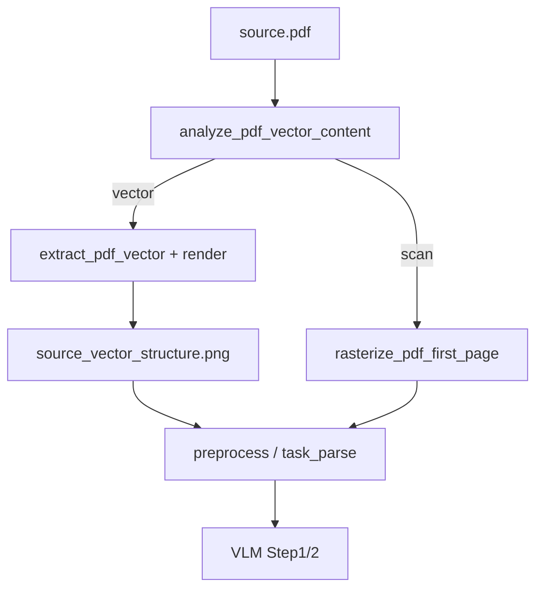

# PDF 矢量 Path 深化 — 实现计划

> **For Claude:** REQUIRED SUB-SKILL: Use executing-plans + TDD to implement task-by-task.  
> **Goal:** 矢量 PDF 提取墙线/文字 path，生成专用 structure 图供 VLM 使用。  
> **Architecture:** `parser_pdf` 扩展矢量分支 → 渲染 `source_vector_structure.png` → preprocess/task_parse 按 `structure_source` 选图 → 可选 Step1 文字 hint。  
> **Tech Stack:** PyMuPDF (fitz)、OpenCV、NumPy  
> **需求文档：** [10-PDF矢量path-需求.md](./10-PDF矢量path-需求.md)  
> **预估周期：** 5～7 天

---

## 里程碑

| 阶段 | 交付 | 工期 |
|------|------|------|
| **P-V0** | 矢量 path 提取 + 渲染 structure 图 | 2d |
| **P-V1** | 接入 preprocess / task_parse | 1.5d |
| **P-V2** | 文字块 Step1 hint | 1d |
| **P-V3** | 测试 fixture + 文档 | 1～1.5d |

---

## Task 1：数据结构与常量

**Files:**
- Modify: `server/app/services/floorplan/parser_pdf.py`
- Create: `server/app/services/floorplan/pdf_vector_types.py`（可选，或同文件内 dataclass）

```python
@dataclass
class PdfWallSegment:
    x1: float; y1: float; x2: float; y2: float
    width: float

@dataclass
class PdfTextBlock:
    text: str
    bbox: tuple[float, float, float, float]  # x0,y0,x1,y1

@dataclass
class PdfVectorExtract:
    wall_segments: list[PdfWallSegment]
    text_blocks: list[PdfTextBlock]
    page_width: float
    page_height: float
    render_scale: float  # PDF pt → pixel
```

**常量：**
- `MIN_WALL_LENGTH_PT = 20`
- `MAX_WALL_WIDTH_PT = 3.0`（过滤粗填充）
- `DIMENSION_BAND_RATIO = 0.12`（与 preprocess CAD 一致）

---

## Task 2：path 提取

**Files:**
- Create: `server/app/services/floorplan/parser_pdf_vector.py`
- Test: `server/tests/test_parser_pdf_vector.py`

**核心 API：**

```python
def extract_pdf_vector(page: fitz.Page, scale: float) -> PdfVectorExtract:
    """
    从首页 get_drawings() 提取线段：
    - line / rect 边框 → PdfWallSegment
    - 过滤长度过短、外围尺寸带
    """

def extract_pdf_text_blocks(page: fitz.Page) -> list[PdfTextBlock]:
    """page.get_text('dict') blocks → 过滤空串、纯数字面积"""
```

**Step 1:** 用 PyMuPDF 程序化生成含矩形墙线的 PDF fixture

**Step 2:** 单测提取 segment 数 ≥ 4

**Step 3:** 单测尺寸带线段被过滤

---

## Task 3：渲染 vector structure 图

**Files:**
- Modify: `server/app/services/floorplan/parser_pdf_vector.py`

```python
def render_vector_structure(
    extract: PdfVectorExtract,
    output_path: Path,
    *,
    width_px: int,
    height_px: int,
) -> None:
    """白底黑线，线宽 2px，与 raster 尺寸对齐"""
```

**坐标变换：** PDF 原点左上 → OpenCV 一致；注意 `page.rect` 与 pixmap scale。

**Step 1:** 渲染图非空、墙线可见（像素方差单测）

---

## Task 4：整合 ensure_raster_source / extract_pdf

**Files:**
- Modify: `server/app/services/floorplan/parser_pdf.py`

**新流程：**

```python
def ensure_pdf_assets(pdf_path: Path, output_dir: Path) -> PdfAssets:
    """
    返回:
      raster_path: source.png（预览）
      vector_structure_path: 仅矢量 PDF 有
      meta: pdf_mode, path_count, structure_source, ...
    """
```

- `vector_rasterized` → 调用 Task 2+3，写 `source_vector_structure.png`
- `scan_rasterized` → 仅 rasterize

**Modify:** `storage.save_upload` / `resolve_parse_image_path` 传递 vector meta

---

## Task 5：preprocess 分支

**Files:**
- Modify: `server/app/services/floorplan/parser_preprocess.py`

```python
def preprocess_floorplan_image(..., structure_input: Path | None = None):
    # 若 meta.structure_source == "vector" 且 vector structure 存在：
    #   跳过 CAD 裁边中的部分步骤，或对其做轻量增强
    #   build_structural_image(vector_structure_bgr)
```

**策略（YAGNI）：**
- 矢量 PDF：**VLM 直接读 `source_vector_structure.png`**（可不再二次 morph）
- 扫描 PDF：保持现网 preprocess

**Files:**
- Modify: `server/app/services/floorplan/task_parse.py`
  - 解析前读 meta，选 `get_structural_path` 或 `get_vector_structural_path`

**新增 storage：**

```python
VECTOR_STRUCTURAL_FILENAME = "source_vector_structure.png"

def get_parse_structural_path(project_id: int) -> Path | None:
    meta = load_meta(...)
    if meta.get("structure_source") == "vector":
        p = project_dir / VECTOR_STRUCTURAL_FILENAME
        return p if p.is_file() else get_structural_path(...)
    return get_structural_path(...)
```

---

## Task 6：Step1 文字 hint（P1）

**Files:**
- Modify: `server/app/services/floorplan/parser_vlm.py`
- Create: `server/app/services/floorplan/pdf_text_hint.py`

```python
def build_pdf_text_hint(text_blocks: list[PdfTextBlock]) -> str | None:
    """合并房间名+面积候选为 Step1 附加段"""
```

**Prompt 片段：**

```
以下文字来自 PDF 矢量层（仅供参考）：
[{"name":"客厅","area_label":"28.8"}, ...]
```

**Step 1:** 单测 hint 格式化；无 text 时返回 None

---

## Task 7：meta 与 API

**Files:**
- Modify: `server/app/services/floorplan/storage.py` — patch_meta 字段
- Modify: `server/app/api/floorplan.py` — GET floorplan 可选暴露 `pdf_mode`（已有 meta 路径则跳过）

**可选：** 写 `pdf_vector_meta.json` 便于调试（`FR-P6`）

---

## Task 8：测试资产

**Files:**
- Create: `server/tests/fixtures/pdfs/vector_cad_minimal.pdf`（脚本生成）
- Create: `scripts/generate-pdf-fixtures.py`
- Expand: `server/tests/test_parser_pdf.py`

**集成测试：**
- mock VLM e2e：上传矢量 PDF fixture → structural 来自 vector 分支

---

## Task 9：文档

**Files:**
- Modify: `docs/04-本地环境检查与安装步骤.md` — PDF 矢量说明
- Modify: `docs/07-户型解析优化方案与需求.md` — FR-B6 状态（实施后）

---

## 回归命令

```bash
cd server && pytest tests/test_parser_pdf.py tests/test_parser_pdf_vector.py -q
pytest tests/test_floorplan_parse_e2e.py -q
```

---

## 提交建议

```
feat(floorplan): extract PDF vector paths and vector structure image (Phase 7-PV)
```

建议 PR 顺序：Task 1-3（提取+渲染）→ Task 4-5（流水线）→ Task 6-9（hint+测试+文档）。

---

## 开放问题（实施前默认）

| # | 问题 | 默认 |
|---|------|------|
| Q1 | 矢量 structure 是否替代 preprocess structural？ | **是**（矢量 PDF） |
| Q2 | 多页 PDF | 仅首页 + meta warning |
| Q3 | path 过多（>500） | 合并共线 + 采样上限 |

---

## 模块依赖图


