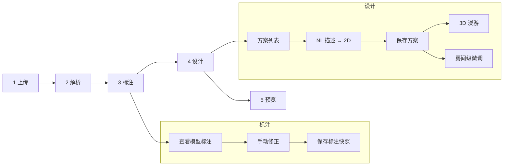
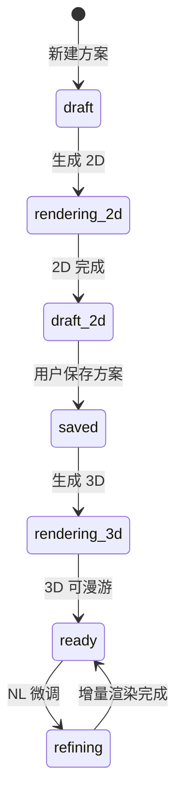

# 户型设计流程重构 — 需求文档

> **文档版本：** v1.0  
> **日期：** 2026-05-24  
> **状态：** 待评审  
> **上级文档：** [02-产品架构与技术方案](./02-产品架构与技术方案.md)  
> **关联原型：** [docs/原型/v2/](./原型/v2/) · [流程线框图](./原型/diagrams/workflow-v2-wireframes.md)

---

## 1. 背景

当前 House-DIY 已具备：户型上传、VLM 解析（含进度与日志）、2D 校对编辑器、设计生成、交付预览等能力。流程步骤命名为「上传 → 解析 → **校对** → 设计 → 预览」，与产品目标存在以下差距：

| 维度 | 现网 | 目标 |
|------|------|------|
| 步骤命名 | 「校对」 | 「**标注**」（强调模型解析 + 人工修正） |
| 上传页 | 含较多说明与字段 | **仅上传框 + 开始解析** |
| 标注能力 | 顶点拖拽、面板新增房间 | **右键新增**、框线拖动、图层预览 |
| 标注持久化 | 与 floorplan 草稿混合 | **每项目唯一标注快照**，覆盖保存 |
| 设计方案 | 单套 DesignSpec | **多套方案** 可切换 |
| 设计流程 | 描述 → 一次性生成 | **2D 确认保存 → 3D 漫游** 分步 |
| 预览 | 交付总览 | **方案列表 + 2D 平铺 + 3D 入口** |
| 项目入口 | 按 status 跳转 | **最高进度步骤** 直达 |
| 流程条 | 绿/灰，无未保存拦截 | **绿/黄/灰** + 未保存切换提醒 |
| 输出目录 | 固定 `projects_dir` / `output_dir` | **系统监控可配置** 统一根目录 + 规范子结构 |

本文档定义重构后的端到端产品行为，作为原型评审与开发验收依据。

---

## 2. 目标与非目标

### 2.1 目标

1. 统一五步主流程：**上传 → 解析 → 标注 → 设计 → 预览**。
2. 标注页支持模型结果展示、图层切换、手动增删改房间，**保存后**作为后续设计唯一几何输入。
3. 设计页支持**多套方案**、2D 渲染确认、3D 漫游、按房间或全局的自然语言微调。
4. 项目记录**最高到达步骤**；列表进入时跳转到最高步骤而非当前浏览步骤。
5. 顶栏流程指示器始终可见，支持自由切换已完成步骤，**未保存变更时拦截**。
6. 系统设置增加**输出根目录**配置，按项目/方案组织生成文件。

### 2.2 非目标（本期）

- 多用户协作、权限、云端同步。
- 标注历史版本栈（仅保留**最新一次**标注保存）。
- 施工图导出、建材清单。
- 替换现有 VLM / ComfyUI 模型架构（沿用语义解析 + 本地渲染管线）。

---

## 3. 流程总览



---

## 4. 功能需求

### 4.1 步骤 1 — 户型图上传

| ID | 需求 | 优先级 |
|----|------|--------|
| FR-U1 | 页面仅保留：**文件上传区**（拖拽/点击，PNG/JPG/PDF）+ **「开始解析」** 按钮 | P0 |
| FR-U2 | 未选择文件时「开始解析」禁用 | P0 |
| FR-U3 | 点击「开始解析」：上传文件 → 创建/更新项目源图 → 跳转步骤 2 并自动触发解析任务 | P0 |
| FR-U4 | 顶栏展示五步流程条；当前步为**黄色**，已完成**绿色**，未到达**灰色** | P0 |
| FR-U5 | 若项目已有上传文件再次进入本步，展示已上传文件名与缩略图，允许替换后重新解析 | P1 |

**页面结构（原型）：**

```
┌─────────────────────────────────────────────────────────┐
│ AppHeader                                    [流程条 1●2○3○4○5○] │
├─────────────────────────────────────────────────────────┤
│                                                         │
│              ┌─────────────────────────┐                  │
│              │   拖拽或点击上传户型图    │                  │
│              │   PNG / JPG / PDF       │                  │
│              └─────────────────────────┘                  │
│                                                         │
│                    [ 开始解析 ]                          │
│                                                         │
└─────────────────────────────────────────────────────────┘
```

---

### 4.2 步骤 2 — 户型图解析

| ID | 需求 | 优先级 |
|----|------|--------|
| FR-P1 | 调用本地 VLM 对户型图解析：房间位置、边界、布局、结构、尺寸、整体比例尺等 | P0 |
| FR-P2 | 页面上方：**解析进度条**、当前步骤名称、解析项列表（如 Step1 语义 / Step2 房间 polygon / 质检） | P0 |
| FR-P3 | 页面下方：**实时后台处理日志**（WebSocket 或轮询 task payload logs） | P0 |
| FR-P4 | 解析进行中禁用流程条切换至其他步骤（或切换时提示「解析进行中」） | P1 |
| FR-P5 | 提供「取消解析」；取消后回到可重新解析状态 | P1 |
| FR-P6 | 解析成功自动进入步骤 3；失败展示错误与重试 | P0 |

**解析项展示示例：**

| 解析项 | 说明 | 状态 |
|--------|------|------|
| 源图预处理 | PDF 栅格化 / 结构图 | 完成 |
| VLM Step1 | 整体布局、比例尺 | 进行中 45% |
| VLM Step2 | 房间 polygon 批次 | 等待 |
| 质检 | IoU / Seg hint | 等待 |

---

### 4.3 步骤 3 — 标注

| ID | 需求 | 优先级 |
|----|------|--------|
| FR-A1 | 展示 VLM 解析后的标注结果（SVG/Canvas 叠加原图） | P0 |
| FR-A2 | 点击画布或预览按钮可**弹窗放大**；弹窗内勾选图层：**原图** / **标注**（可同时勾选叠加显示） | P0 |
| FR-A3 | 支持**手动修改**标注：新增、调整、删除房间 | P0 |
| FR-A4 | **保存标注**：写入项目唯一标注快照；后续设计仅读取已保存标注 | P0 |
| FR-A5 | 可再次编辑并保存，**每次保存覆盖**上一版（无多版本历史） | P0 |
| FR-A6 | 本页存在未保存变更时，切换流程步骤须**弹窗提醒**先保存或放弃 | P0 |

#### 4.3.1 新增标注房间（FR-A7～A9）

| ID | 需求 | 优先级 |
|----|------|--------|
| FR-A7 | 在画布**单击右键**弹出房间类型菜单（客厅、卧室、厨房等预设类型） | P0 |
| FR-A8 | 以右键点击位置为中心，**自适应框出**初始房间范围（矩形或多边形初值） | P0 |
| FR-A9 | 用户拖动顶点/边线调整后，依据项目**比例尺**实时计算并显示房间面积（㎡） | P0 |

#### 4.3.2 调整已标注房间（FR-A10～A11）

| ID | 需求 | 优先级 |
|----|------|--------|
| FR-A10 | **左键单击**选中已有房间（高亮） | P0 |
| FR-A11 | 拖动房间**框线/控制点**调整范围；面积随比例尺实时更新 | P0 |

#### 4.3.3 删除标注房间（FR-A12）

| ID | 需求 | 优先级 |
|----|------|--------|
| FR-A12 | 左侧房间列表选中房间 → 点击「删除」移除该房间标注 | P0 |

**与现网差异：** 现网为右侧面板选类型 + 左键放置；目标为**右键菜单** + 自适应初始框。现网已有顶点拖拽，需补充**边线拖动**与统一「保存标注」语义。

---

### 4.4 步骤 4 — 设计

| ID | 需求 | 优先级 |
|----|------|--------|
| FR-D1 | 左侧**方案列表**：同一户型可有多套设计方案，点击切换当前编辑方案 | P0 |
| FR-D2 | 支持「新建方案」；每套方案独立 DesignSpec + 渲染产物 | P0 |
| FR-D3 | 输入自然语言描述 → 调用模型生成 **2D 效果图**（按房间） | P0 |
| FR-D4 | 用户确认 2D 无误后点击**「保存方案」**持久化当前方案 | P0 |
| FR-D5 | **「生成 3D 漫游」**：基于**当前已保存**的设计方案构建 3D 场景 | P0 |
| FR-D6 | 下方展示各房间 2D 预览缩略图；**选中**某房间后输入 NL 描述 →「应用」仅调整该房间 | P0 |
| FR-D7 | 未选中任何房间时，「应用」对**全部房间**生效 | P0 |
| FR-D8 | 设计页未保存变更（描述/微调未应用）切换步骤时同样拦截 | P1 |

**方案状态：**



**与现网差异：** 现网为单 `design_spec.json`；需扩展为 `schemes/{scheme_id}/` 多方案存储。

---

### 4.5 步骤 5 — 预览

| ID | 需求 | 优先级 |
|----|------|--------|
| FR-V1 | 顶部或左侧选择**方案**（列表与步骤 4 一致） | P0 |
| FR-V2 | 主区域**平铺展示**该方案下全部房间 **2D 效果图** | P0 |
| FR-V3 | 右上角 **「进入 3D 漫游」** 按钮 → 跳转 Three.js 全屋漫游（基于该方案 3D） | P0 |
| FR-V4 | 只读模式：预览页不提供编辑，编辑需回到步骤 4 | P1 |

---

### 4.6 项目最高进度（FR-S1～S4）

| ID | 需求 | 优先级 |
|----|------|--------|
| FR-S1 | 每个项目持久化 `max_step`（或等价字段），取用户**曾到达的最高步骤**，只增不减 | P0 |
| FR-S2 | 示例：用户已进入「设计 · 2D 已生成」，即使回到「标注」页编辑，项目 `max_step` 仍为 **design** | P0 |
| FR-S3 | 项目列表点击项目 → **直接进入 `max_step` 对应页面**，而非上次浏览页 | P0 |
| FR-S4 | `max_step` 与 `Project.status` 映射见 §6；解析中/失败等 transient 状态不降低 `max_step` | P0 |

**步骤与进度关系：**

| max_step | 含义 | 列表入口路由 |
|----------|------|--------------|
| upload | 仅创建项目 | 上传 |
| parse | 已上传源图 | 解析（若已完成解析则标注） |
| annotate | 解析完成或已保存标注 | 标注 |
| design | 至少一套方案 2D 已保存 | 设计 |
| preview | 至少一套方案 3D 就绪 | 预览 |

---

### 4.7 流程步骤条（FR-B1～B5）

| ID | 需求 | 优先级 |
|----|------|--------|
| FR-B1 | 五步条**始终展示**于项目相关页顶（上传/解析/标注/设计/预览） | P0 |
| FR-B2 | **已完成**步骤：绿色，可点击跳转 | P0 |
| FR-B3 | **当前**步骤：黄色高亮 | P0 |
| FR-B4 | **未到达**步骤：灰色，不可点击 | P0 |
| FR-B5 | 从标注/设计等**需保存**的步骤切换时，若有 dirty 状态 → Modal：「请先保存变更 / 放弃并离开 / 取消」 | P0 |

**视觉规范：**

| 状态 | 颜色 | 交互 |
|------|------|------|
| 已完成 | `#8fd4a8` 背景 `#2c4a3e` | 可点击 |
| 进行中 | `#f0c14b` 背景 `#5c4a1e` | 当前页 |
| 未开始 | `#888` 背景 `#333` | disabled |

---

### 4.8 输出目录配置（FR-F1～F6）

| ID | 需求 | 优先级 |
|----|------|--------|
| FR-F1 | 系统监控/设置页增加 **「输出根目录」** 配置项（可浏览选择或手输绝对路径） | P0 |
| FR-F2 | 该目录存放整体设计流程生成的**全部文件**（替代或统一现有 `house_diy_projects_dir` + `house_diy_output_dir`） | P0 |
| FR-F3 | 目录结构规范如下（`{root}` 为配置的根路径） | P0 |
| FR-F4 | 保存后立即生效；新项目按新路径；旧项目可迁移或只读旧路径（实现阶段定策略） | P1 |
| FR-F5 | Health/设置页展示当前根路径与磁盘可写状态 | P1 |
| FR-F6 | 环境变量 `HOUSE_DIY_OUTPUT_ROOT` 与 UI 配置联动（UI 优先或写入 `.env`） | P1 |

**目录结构：**

```
{output_root}/
└── {project_id}/                    # 项目子目录
    ├── source.png                   # 上传原图（或 source.pdf）
    ├── source_structural.png        # 结构图
    ├── floorplan.json               # 标注数据（保存后 status=confirmed）
    ├── meta.json                    # 元数据
    └── schemes/
        └── {scheme_id}/             # 每套设计方案
            ├── design_spec.json
            ├── renders/
            │   └── {room_id}.png    # 2D 效果图
            └── scene/               # 3D 漫游资产
                ├── scene.json
                └── ...
```

---

## 5. 用户场景与验收

| ID | 场景 | 验收要点 |
|----|------|----------|
| US-1 | 新建项目上传 PNG 并开始解析 | 上传页仅两元素；解析页见进度+日志；完成后进标注 |
| US-2 | 标注页放大预览 | 默认原图+标注；可单独关闭某图层 |
| US-3 | 右键新增卧室并调框 | 出现初始框；面积随比例尺变化；保存后刷新仍存在 |
| US-4 | 未保存切换至设计 | 弹出保存提醒；放弃后变更丢失 |
| US-5 | 创建两套方案并分别生成 2D | 方案列表可切换；预览页按方案平铺 2D |
| US-6 | 保存方案后生成 3D | 预览页可进入 3D；漫游加载当前方案 scene |
| US-7 | 项目已到设计，用户回标注修改 | 列表入口仍进**设计**；流程条可手动回标注 |
| US-8 | 修改输出根目录 | 新解析/保存文件写入新路径；设置页显示路径 |

---

## 6. 数据模型与 API 变更（概要）

### 6.1 Project 扩展

```python
# 建议新增
max_step: Literal["upload", "parse", "annotate", "design", "preview"]
active_scheme_id: str | None  # 当前选中的设计方案
```

`ProjectStatus` 与 `max_step` 并存：`status` 表示**当前运行态**（如 parsing）；`max_step` 表示**业务最高进度**。

### 6.2 步骤枚举（前端）

| 现网 key | 新 key | 标签 |
|----------|--------|------|
| upload | upload | 1 上传 |
| parse | parse | 2 解析 |
| review | **annotate** | **3 标注** |
| design | design | 4 设计 |
| preview | preview | 5 预览 |

### 6.3 标注保存 API

| 方法 | 路径 | 说明 |
|------|------|------|
| PUT | `/api/v1/projects/{id}/floorplan/annotation` | 保存标注快照，覆盖；`status=confirmed`；更新 `max_step≥annotate` |

### 6.4 设计方案 API（新增）

| 方法 | 路径 | 说明 |
|------|------|------|
| GET | `/projects/{id}/schemes` | 方案列表 |
| POST | `/projects/{id}/schemes` | 新建方案 |
| PUT | `/projects/{id}/schemes/{sid}` | 保存方案（2D 确认） |
| POST | `/projects/{id}/schemes/{sid}/generate-2d` | 生成 2D |
| POST | `/projects/{id}/schemes/{sid}/generate-3d` | 生成 3D |
| POST | `/projects/{id}/schemes/{sid}/refine` | NL 微调（可选 room_id） |

### 6.5 设置 API

| 方法 | 路径 | 说明 |
|------|------|------|
| GET/PUT | `/api/v1/settings/storage` | 读写 `output_root` |

---

## 7. 与现网实现对照

| 模块 | 现网 | 重构动作 |
|------|------|----------|
| `FloorPlanUploadView` | 多文案/字段 | 精简为上传+按钮 |
| `FloorPlanParseView` | 已有进度+日志 | 对齐解析项 UI；步骤名 |
| `FloorPlanEditor` | 校对、面板新增 | 改名标注；右键菜单；保存语义；dirty 拦截 |
| `ProjectStepBar` | done/active/灰 | 黄/绿/灰；未保存 Modal |
| `projectNavigation.ts` | review、maxCompletedIndex | annotate；`max_step` API |
| `design/storage.py` | 单 spec | 多 scheme 目录 |
| `DesignStudioView` | 单次 generate | 方案列表 + 2D 保存 + 3D 分步 |
| `DeliveryOverviewView` | 交付总览 | 预览：方案选择 + 2D 网格 + 3D |
| `SettingsView` | 服务监控 | + 输出根目录配置 |
| `config.py` | 两个目录项 | 统一 `output_root` 或映射 |

---

## 8. 非功能需求

| ID | 需求 |
|----|------|
| NFR-1 | 解析/渲染日志延迟 &lt; 2s（WebSocket 推送） |
| NFR-2 | 标注页 1080p 原图交互 ≥ 30fps 拖拽 |
| NFR-3 | 输出目录不可写时，保存/生成给出明确错误 |
| NFR-4 | 全流程离线；无新增外网依赖 |

---

## 9. 里程碑建议

| 阶段 | 范围 | 交付 |
|------|------|------|
| M1 | 流程条 + 步骤重命名 + 上传/解析页 | 可演示五步导航 |
| M2 | 标注保存语义 + 右键新增 + dirty 拦截 | 标注闭环 |
| M3 | max_step + 列表入口 | 进度记忆 |
| M4 | 多方案 + 2D/3D 分步 + 预览 | 设计闭环 |
| M5 | 输出目录配置 + 迁移 | 运维可配置 |

---

## 10. 开放问题（评审确认）

1. **放弃变更**：切换步骤时「放弃并离开」是否需二次确认？
2. **重新解析**：覆盖标注后是否自动降低 `max_step` 至 annotate？
3. **方案上限**：每项目最多 N 套方案是否限制（建议默认无硬限，UI 提示 &gt;10 性能）？
4. **旧数据迁移**：现有 `{projects_dir}/{id}/design_spec.json` 是否自动导入为 `schemes/default`？

---

*文档结束 · 请先评审本文档与 HTML 原型，确认后再进入实现计划。*
