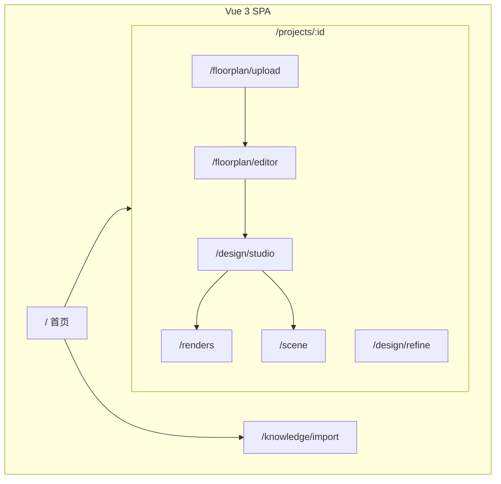
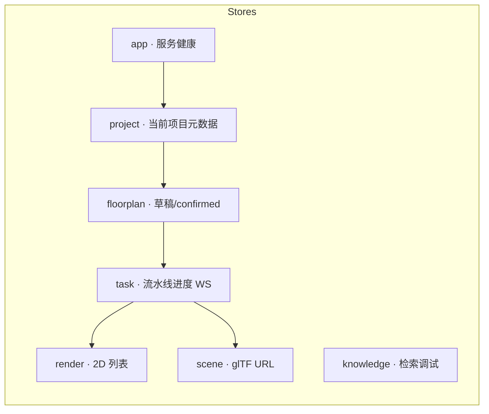

# House-DIY 信息架构

## 站点地图



## Vue Router 建议

| 路径 | 组件 | 阶段 |
|------|------|------|
| `/` | HomeView | P0 |
| `/projects/:id/upload` | FloorPlanUpload | P1 |
| `/projects/:id/editor` | FloorPlanEditor | P1 |
| `/projects/:id/studio` | DesignStudio | P2–P4 |
| `/projects/:id/refine` | DesignRefine | P2–P4 |
| `/projects/:id/gallery` | RenderGallery | P2 |
| `/projects/:id/scene` | SceneViewer3D | P3 |
| `/knowledge/import` | KnowledgeImport | P5 |

## Pinia Store 划分



## 布局结构（全局）

```
┌─────────────────────────────────────────────────────────┐
│ TopBar: Logo · 项目名 · 步骤条 · 服务状态灯              │
├──────────┬──────────────────────────────────────────────┤
│ Sidebar  │ Main Content                                  │
│ (项目内) │ · 上传 / 画布 / 表单 / 画廊 / 3D 视口          │
│          │                                               │
└──────────┴──────────────────────────────────────────────┘
```

## 页面与后端模块映射

| 页面 | FastAPI 服务 |
|------|----------------|
| 02-upload | floorplan.py, parser_vlm, parser_cv |
| 03-editor | floorplan.py |
| 04-studio | orchestrator, scheduler, knowledge |
| 05-gallery | comfy_client |
| 06-scene | scene_builder |
| 07-knowledge | knowledge/vault_io, indexer |
