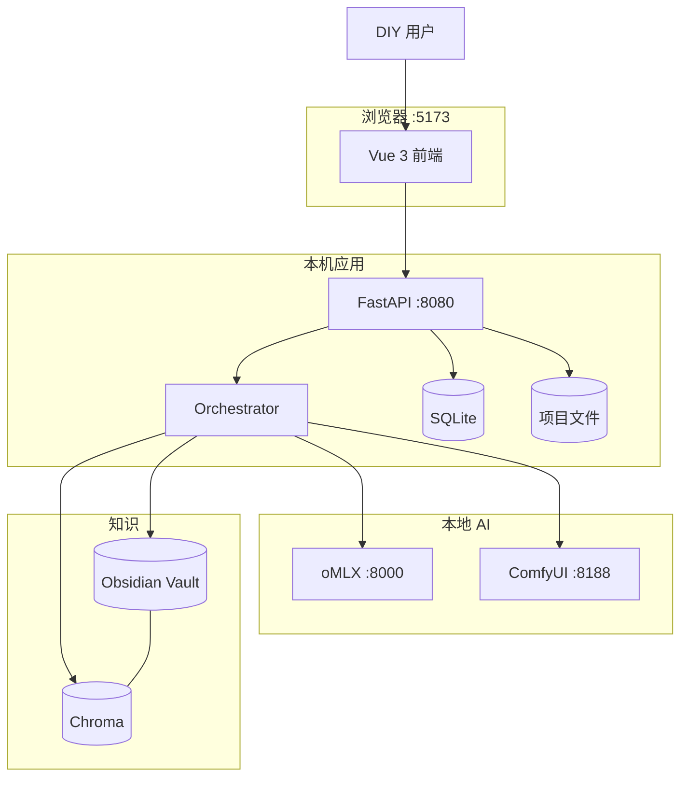

# 系统上下文与原型映射

## 系统上下文（C4 简化）

## 原型页面 ↔ 里程碑

| 原型 | P0 | P1 | P2 | P3 | P4 | P5 |
|------|:--:|:--:|:--:|:--:|:--:|:--:|
| 01-home | ● | | | | | |
| 02-upload | | ● | | | | |
| 03-editor | | ● | | | | |
| 04-studio | | | ● | | ● | ● |
| 05-gallery | | | ● | | ● | |
| 06-scene | | | | ● | ● | |
| 07-knowledge | | | | | | ● |

## 关键交互约束（原型体现）

1. **离线优先**：无登录、无云同步 UI
2. **强制校对**：03-editor 确认前 04-studio 生成按钮禁用
3. **GPU 串行**：04-studio 进度表体现 VLM/Comfy/LLM 互斥
4. **Obsidian 可读**：生成完成后提供「在 Vault 打开案例」入口
5. **RAG 可选展示**：04-studio 侧栏展示 Top 参考（P5 完整）

## 屏幕分辨率建议

| 页面 | 最小宽度 | 备注 |
|------|----------|------|
| 03-editor | 1280px | 画布需宽屏 |
| 06-scene | 1280px | 全屏 3D 视口 |
| 其他 | 1024px | 响应式表格折叠 |
