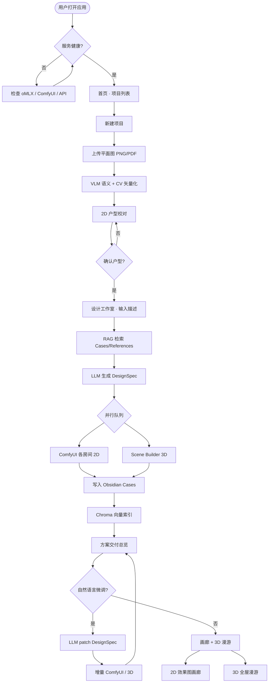
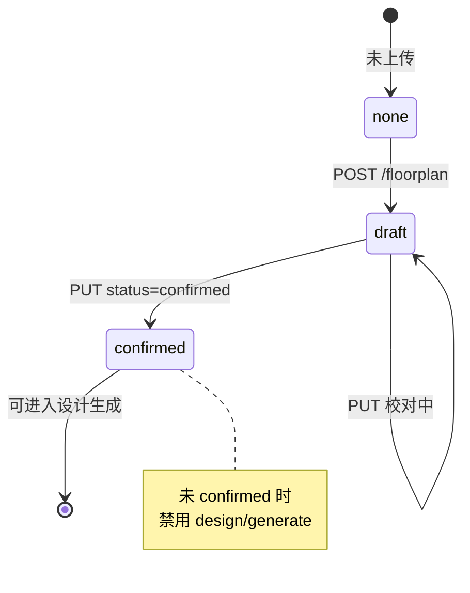
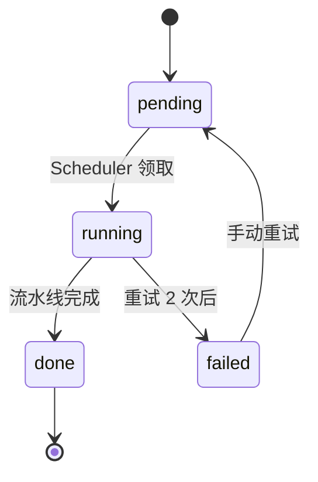

# House-DIY 用户主流程

> 对应产品文档 02 §3 端到端数据流、03 里程碑 P1–P5

## 主流程（Mermaid）

## 户型状态机

## 设计生成任务状态

## API 触点一览

| 用户动作 | 前端页面 | API |
|----------|----------|-----|
| 查看服务状态 | 01-home | GET /health |
| 新建项目 | 01-home | POST /projects |
| 上传平面图 | 02-upload | POST /projects/{id}/floorplan |
| 保存校对 | 03-editor | PUT /projects/{id}/floorplan |
| 开始设计 | 05-studio | POST /projects/{id}/design/generate |
| 微调方案 | 07-refine | POST /projects/{id}/design/refine |
| 查看进度 | 04-studio | WS /projects/{id}/ws |
| 浏览效果图 | 05-gallery | GET /projects/{id}/renders |
| 3D 漫游 | 06-scene | GET /projects/{id}/scene |
| 导入参考 | 07-knowledge | POST /knowledge/import |
| 重建索引 | 07-knowledge | POST /knowledge/reindex |
