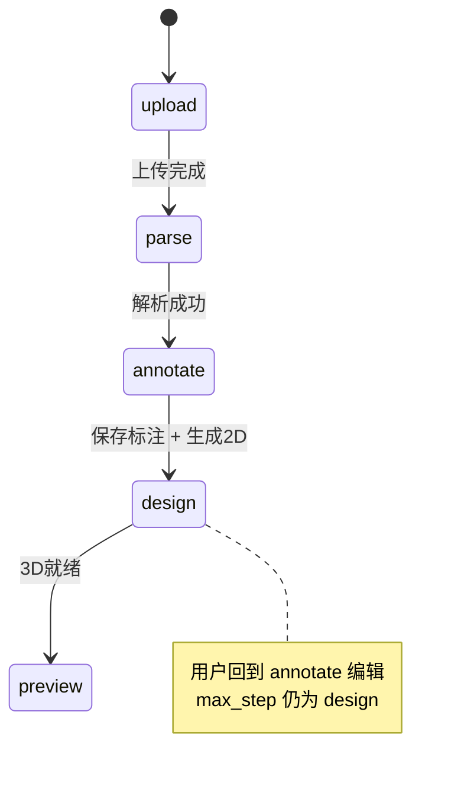

# 流程重构 v2 — 线框与信息架构

> 对应 [11-流程重构需求.md](../../11-流程重构需求.md)  
> 可交互原型：[../v2/index.html](../v2/index.html)

---

## 1. 全局流程条组件

所有项目内页面顶栏下方固定展示：

```
  [1 上传]──[2 解析]──[3 标注]──[4 设计]──[5 预览]
     🟢        🟢        🟡        ⚪        ⚪
   已完成     已完成     进行中    未开始    未开始
```

| 样式类 | 含义 | CSS 参考 |
|--------|------|----------|
| `.step-done` | 已完成 | 绿 `#8fd4a8` / `#2c4a3e` |
| `.step-active` | 当前 | 黄 `#f0c14b` / `#5c4a1e` |
| `.step-pending` | 未到达 | 灰 `#888` / `#333`，disabled |

未保存拦截 Modal：

```
┌──────────────────────────────────┐
│  有未保存的变更                    │
│  切换步骤前请先保存标注，或放弃变更。 │
│                                  │
│   [取消]  [放弃并离开]  [保存并继续] │
└──────────────────────────────────┘
```

---

## 2. 步骤 1 — 上传

```
┌──────────────────────────────────────────────────────────────┐
│ House-DIY    项目 | 知识库 | 设置          ● oMLX  ● ComfyUI │
├──────────────────────────────────────────────────────────────┤
│  ●上传  ●解析  ○标注  ○设计  ○预览                            │
├──────────────────────────────────────────────────────────────┤
│                                                              │
│                    ┌──────────────────────┐                  │
│                    │                      │                  │
│                    │    ↑ 拖拽或点击上传      │                  │
│                    │    PNG / JPG / PDF     │                  │
│                    │                      │                  │
│                    └──────────────────────┘                  │
│                         plan.pdf ✓                           │
│                                                              │
│                      [ 开始解析 ]                             │
│                                                              │
└──────────────────────────────────────────────────────────────┘
```

---

## 3. 步骤 2 — 解析

```
┌──────────────────────────────────────────────────────────────┐
│  ●上传  ●解析  ○标注  ○设计  ○预览              [ 取消解析 ]   │
├──────────────────────────────────────────────────────────────┤
│  解析进度  ████████████░░░░░░░░  62%                          │
│  当前：VLM Step2 · 房间 polygon 批次 2/4                      │
├──────────────────────────────────────────────────────────────┤
│  解析项                                                        │
│  ✓ 源图预处理    ✓ VLM Step1 布局/比例尺                       │
│  ● VLM Step2 房间   ○ 质检                                    │
├──────────────────────────────────────────────────────────────┤
│  处理日志                                            [自动滚动] │
│  ┌────────────────────────────────────────────────────────┐  │
│  │ 14:02:01 [INFO] raster ready 2048x1536                 │  │
│  │ 14:02:15 [INFO] VLM step1 scale=1:100                  │  │
│  │ 14:02:40 [INFO] batch 2/4 rooms: 主卧, 次卧             │  │
│  └────────────────────────────────────────────────────────┘  │
└──────────────────────────────────────────────────────────────┘
```

---

## 4. 步骤 3 — 标注

```
┌──────────────────────────────────────────────────────────────┐
│  ●上传  ●解析  ●标注  ○设计  ○预览        [放大] [保存标注]    │
├──────────────┬───────────────────────────────────────────────┤
│ 房间列表      │                                               │
│ □ 客厅 32㎡  │         ┌─────────────────────────┐          │
│ ■ 主卧 18㎡  │         │ 原图 + 房间 polygon 叠加   │          │
│ □ 厨房 8㎡   │         │      (可拖拽顶点/边)       │          │
│              │         └─────────────────────────┘          │
│ [删除选中]    │   右键 → 新增房间类型菜单                       │
├──────────────┴───────────────────────────────────────────────┤
```

**放大弹窗：**

```
┌─────────────────────────────────────────────┐
│  标注预览                          [ × ]     │
│  ☑ 原图   ☑ 标注                             │
│  ┌─────────────────────────────────────┐    │
│  │         (全屏 canvas)                │    │
│  └─────────────────────────────────────┘    │
└─────────────────────────────────────────────┘
```

---

## 5. 步骤 4 — 设计

```
┌──────────────────────────────────────────────────────────────┐
│  ●上传  ●解析  ●标注  ●设计  ○预览                            │
├──────────┬───────────────────────────────────────────────────┤
│ 方案列表  │  风格描述                                          │
│ ● 方案 A │  ┌─────────────────────────────────────────┐    │
│ ○ 方案 B │  │ 现代简约，暖白墙面，原木家具…              │    │
│ + 新建   │  └─────────────────────────────────────────┘    │
│          │  [ 生成 2D ]  [ 保存方案 ]  [ 生成 3D 漫游 ]       │
│          ├───────────────────────────────────────────────────┤
│          │  房间预览（点击选中）                               │
│          │  [客厅] [主卧●] [厨房] [卫生间]                    │
│          │  微调：┌──────────────────────┐ [ 应用 ]          │
│          │        │ 主卧改成深色木地板      │                   │
│          │        └──────────────────────┘                   │
│          │  未选房间 → 应用至全部                              │
└──────────┴───────────────────────────────────────────────────┘
```

---

## 6. 步骤 5 — 预览

```
┌──────────────────────────────────────────────────────────────┐
│  ●上传  ●解析  ●标注  ●设计  ●预览     方案 [方案 A ▼]  [3D漫游]│
├──────────────────────────────────────────────────────────────┤
│  ┌─────────┐  ┌─────────┐  ┌─────────┐  ┌─────────┐         │
│  │ 客厅 2D │  │ 主卧 2D │  │ 厨房 2D │  │ 卫 2D   │         │
│  └─────────┘  └─────────┘  └─────────┘  └─────────┘         │
│                                                              │
└──────────────────────────────────────────────────────────────┘
```

---

## 7. 设置 — 输出目录

```
┌──────────────────────────────────────────────────────────────┐
│  系统监控与设置                                               │
├──────────────────────────────────────────────────────────────┤
│  输出根目录                                                   │
│  ┌──────────────────────────────────────┐ [ 浏览… ]          │
│  │ /Users/me/House-DIY-Output            │                  │
│  └──────────────────────────────────────┘                  │
│  状态：可写 ✓   当前项目数：12                                 │
│  结构：{root}/{project_id}/…/schemes/{scheme_id}/renders     │
│  [ 保存配置 ]                                                 │
└──────────────────────────────────────────────────────────────┘
```

---

## 8. 状态机 — max_step



---

## 9. 路由映射（Vue）

| 步骤 | route name | 组件 |
|------|------------|------|
| upload | floorplan-upload | FloorPlanUploadView |
| parse | floorplan-parse | FloorPlanParseView |
| annotate | floorplan-annotate | FloorPlanEditorView |
| design | design-studio | DesignStudioView |
| preview | delivery-overview | DeliveryOverviewView |
